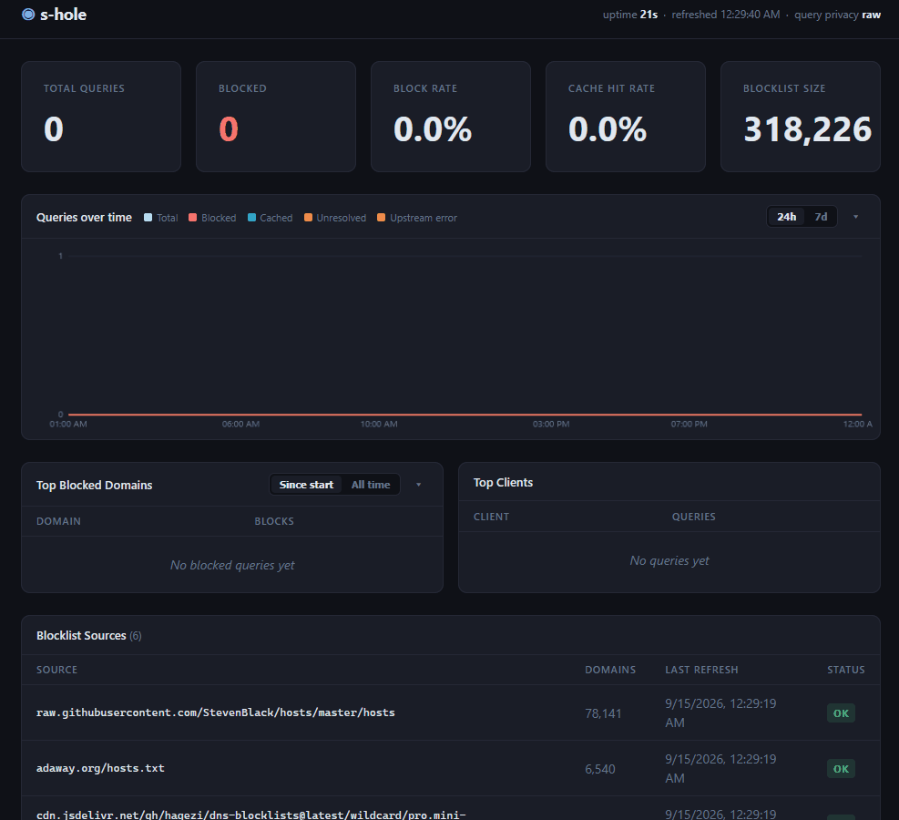

# s-hole

[](https://github.com/lcsabi/s-hole/actions/workflows/ci.yml)
[](https://github.com/lcsabi/s-hole/releases/latest)
[](https://pkg.go.dev/github.com/lcsabi/s-hole)
[](go.mod)
[](LICENSE)

A lightweight, self-contained DNS sinkhole for network-wide ad and tracker blocking. Deploy it on any always-on machine, point your router's DHCP DNS field at it, and every device on the network is protected, with no per-device configuration required.

s-hole is intentionally small: a single binary, a single YAML config file, no runtime dependencies. The full codebase fits comfortably in an afternoon's reading.



### Contents

- [Features](#features)
- [Scope & limitations](#scope--limitations)
- [Quick Start](#quick-start)
- [Configuration](#configuration) (incl. [env-var overrides](#environment-variable-overrides))
- [REST API](#rest-api)
- [Deployment](#deployment): [Linux/Pi](#raspberry-pi--linux-systemd), [Docker](#docker), [Windows](#windows-system-service)
- [Building from Source](#building-from-source)
- [Engineering highlights](#engineering-highlights): the code and the process
- [Architecture](#architecture)
- [Development](#development): targets, coverage, CI, fuzz, integration test
- [Security Notes](#security-notes)
- [License](#license)

For maintainer-facing material, see `docs/DESIGN.md` (design rationale), `docs/CL.md` (change-list index → `docs/cls/`), `docs/BUGS.md` (bug tracker with priorities and root-cause records), `docs/CHANGELOG.md` (release notes), `docs/ROADMAP.md` (planned work and non-goals), and `CONTRIBUTING.md`.

---

## Features

- **Network-wide blocking.** Blocks ads and trackers at the DNS layer, before any connection is established.
- **Subdomain (suffix) blocking.** A blocked domain blocks its whole subtree, so `ads.example.com` also covers `x.ads.example.com`. Trackers cannot dodge a list entry by rotating subdomains.
- **Community blocklists.** Downloads and auto-refreshes hosts-file or plain-domain lists from any URL.
- **DNS response cache.** Serves repeat queries from memory. Typical cache hit rates of 40–70% reduce upstream load and latency.
- **Resilient upstream forwarding.** Tries upstreams in order over UDP, falls back to TCP on truncation, and skips recently-failed resolvers until they recover.
- **Local reverse DNS.** Answers PTR queries for the RFC 6303 private ranges (`10/8`, `172.16/12`, `192.168/16`, and IPv6 ULA and link-local) locally, so internal LAN addressing never leaks to the upstream resolver. On by default; opt out with `local_ptr: false`.
- **Dual query log.** A plain-text file for `grep` and `tail`, plus a SQLite database for historical queries.
- **Admin web UI.** Live stats, top blocked domains, per-source blocklist health, recent query log, whitelist management, and a "why is this blocked?" domain check. Auto-refreshes every 3 seconds.
- **REST API.** All UI data is available as JSON, ready for scripting and future integrations.
- **Observability.** Serves Prometheus metrics at `/metrics` and liveness and readiness probes at `/healthz` and `/readyz`, with no external metrics library.
- **Configurable sinkhole mode.** Returns `0.0.0.0` (the default, a silent failure) or `NXDOMAIN`.
- **Cross-platform.** A single binary for Windows, Linux x86-64, Linux arm64 (Pi 4/5), and Linux armv7 (Pi 2/3).
- **Windows Service.** Installs as an auto-start system service with one command.
- **Linux systemd.** Ships a hardened unit file with `CAP_NET_BIND_SERVICE`, so it needs no root at runtime.
- **Docker.** A multi-stage image of about 33 MB.

---

## Scope & limitations

- **DNS blocking is domain-granular.** It blocks third-party ad and tracker
  networks and device telemetry well, but it cannot touch ads served from the
  same domain as the content. Run a browser content blocker alongside it for
  the first-party and element-level filtering it cannot do.
- s-hole matches on the queried name and does not follow CNAME chains, so a
  cloaked tracker disguised as a first-party subdomain can slip past a
  blocklist entry. Following those chains (CNAME deep-inspection) is on the
  roadmap.
- **Faster browsing comes from blocking, not acceleration.** s-hole usually
  makes pages feel faster because the browser has less to load, not because
  your network is faster. A blocked ad or tracker domain returns `0.0.0.0`, so
  the browser never fetches that content. Repeat DNS lookups return from the
  in-memory cache with no upstream round-trip. The effect is largest on
  ad-heavy pages and low-end devices.
- **It is not a content cache.** s-hole answers DNS only. A first-time lookup
  of an allowed domain still forwards upstream through s-hole. This adds a
  small hop on a healthy LAN, but it is not faster than a direct query. s-hole
  never caches or proxies the pages you visit, so it cannot speed up
  first-party content or raise your bandwidth.

---

## Quick Start

### Prerequisites

- Go 1.25 or later (for building from source)
- Port 53 available (requires Administrator on Windows, root or `CAP_NET_BIND_SERVICE` on Linux)

### Install a pre-built release

Each tagged release attaches a per-target archive and a `SHA256SUMS` file to the
[GitHub Releases page](https://github.com/lcsabi/s-hole/releases). Download the
archive for your platform (`linux_amd64`, `linux_arm64`, `linux_armv7`, or
`windows_amd64`), then verify and unpack it:

```bash
sha256sum -c SHA256SUMS --ignore-missing   # confirm the download
tar -xzf s-hole_v0.2.0_linux_amd64.tar.gz  # Linux (unzip the .zip on Windows)
```

Each archive contains the binary, a sample `config.yaml`, `LICENSE`, `README.md`,
and (on Linux) the `deploy/` install scripts and systemd unit. The same tag also
publishes a container image; see [Docker](#docker) for the pull command.

### Install via the Go toolchain

If your `$GOBIN` is on `PATH`, the latest commit can be fetched with:

```bash
go install github.com/lcsabi/s-hole/cmd/s-hole@latest
```

### Run interactively

```bash
# Build from a local clone
go build -o s-hole ./cmd/s-hole

# Run (requires elevated privileges for port 53)
sudo ./s-hole -config config.yaml          # Linux / macOS
.\s-hole.exe -config config.yaml           # Windows (Administrator)
```

On first run, s-hole downloads the blocklists (~80 000 domains with the default lists, and the exact count shifts as the upstream lists evolve) and caches them to disk. Later starts skip the download when the cache is less than 24 hours old.

Each source download is capped at 256 MiB. Real blocklists are far smaller, so hitting the cap means a wrong URL or a broken source. If a source exceeds the cap, s-hole logs a WARN, keeps serving the previous cached copy of that source (marked stale), and does not replace it with the truncated download.

### Point your router at it

In your router's DHCP settings, set the **DNS Server** field to the IP address of the machine running s-hole. All devices on the network get the new DNS server on their next DHCP renewal (or immediately after they reconnect).

Keep a fallback upstream DNS as the secondary DNS entry (for example `1.1.1.1`). s-hole can become unavailable, so the fallback keeps the LAN online.

> **IPv6 networks:** on a dual-stack LAN, routers typically advertise a
> DNS server over IPv6 as well (via RA/RDNSS or DHCPv6), and many
> clients *prefer* it. If that advertisement still points at the router
> or your ISP, dual-stack devices will quietly bypass s-hole for most
> queries and the ads come back. Either disable the router's IPv6 DNS
> advertisement, or give the s-hole machine a stable IPv6 address and
> advertise that instead (s-hole listens on IPv6 by default via
> `listen: ":53"`).

### Verify it works

With `nslookup` (preinstalled on Windows and macOS):

```
nslookup doubleclick.net <s-hole-ip>
# expected: Address: 0.0.0.0

nslookup google.com <s-hole-ip>
# expected: a real IP address
```

Or with `dig` (`apt install dnsutils` / `dnf install bind-utils`):

```
dig @<s-hole-ip> doubleclick.net +short   # expected: 0.0.0.0
dig @<s-hole-ip> google.com +short        # expected: a real IP address
```

These commands address s-hole explicitly, so they work even before the
router change above. Network-wide blocking begins only after DHCP hands
out s-hole's address and clients renew their leases. Then devices are
filtered without naming the server.

If a query times out, check s-hole's query log (stdout, or
`journalctl -u s-hole -f` under systemd): every query that reaches the
process produces one `ALLOW`/`BLOCK` line. A missing line means the
query never arrived. Look at the network path (firewall, wrong IP,
client tool) rather than at s-hole. Under the Windows service stdout is
discarded, so set `log_file` to capture these query lines; the
application log (startup, refresh, and audit messages) goes to the
Windows Event Log automatically.

---

## Configuration

All configuration lives in `config.yaml`. Every field has a safe default; an empty file is valid.

| Field | Default | Description |
|---|---|---|
| `listen` | `:53` | Address and port for DNS queries (UDP + TCP). `:53` binds all interfaces, IPv4 + IPv6; use `0.0.0.0:53` for IPv4 only |
| `upstreams` | `[1.1.1.1:53, 8.8.8.8:53]` | Upstream resolvers, tried in order |
| `blocklists` | StevenBlack + AdAway | List of URLs to download (hosts-file or plain-domain format) |
| `whitelist` | `[]` | Domains that are never blocked, regardless of blocklist membership. Matched by suffix and wins at every level: a whitelisted domain exempts its whole subtree, even past a more specific blocked parent |
| `refresh_interval` | `24h` | How often to re-download blocklists |
| `block_mode` | `zero` | Sinkhole reply: `zero` returns `0.0.0.0`/`::`, `nxdomain` returns NXDOMAIN |
| `block_ttl` | `300` | TTL (seconds) advertised on blocked replies; `0` tells clients not to cache them |
| `log_file` | stdout | Path to the plain-text query log |
| `log_queries` | `all` | Which queries to write to logs: `all`, `blocked`, or `none` |
| `query_db` | _(off)_ | Path to the SQLite query log database; set a path to enable, empty disables it |
| `db_flush_interval` | `30s` | How often buffered queries are committed to SQLite |
| `cache_size` | `2000` | Maximum DNS responses held in the in-memory cache (0 to disable) |
| `stats_interval` | `5m` | How often stats are printed to stdout |
| `api_listen` | `127.0.0.1:8080` | Address for the admin web UI and REST API. Set to `0.0.0.0:8080` to expose to the LAN. |
| `cache_dir` | `.` | Directory for cached blocklist files |
| `query_db_retention_days` | `0` (forever) | Delete query-log rows older than this many days. `0` disables the prune. |
| `enable_pprof` | `false` | Expose `/debug/pprof/*` on the admin server. Localhost-only deployment recommended. |
| `local_ptr` | `true` | Answer PTR queries for RFC 6303 private ranges (10/8, 172.16/12, 192.168/16, fc00::/7, fe80::/10) locally with NXDOMAIN. Set to `false` if you run a private reverse DNS zone on your LAN. |

### Minimal config example

```yaml
upstreams:
  - "9.9.9.9:53"     # Quad9, privacy-focused and malware-blocking
whitelist:
  - "api.example.com"
log_queries: blocked
```

### Environment variable overrides

For container deployments where editing `config.yaml` requires a re-bind-mount, every commonly-tuned field can be overridden by an `S_HOLE_*` environment variable. The override is applied after the YAML is parsed:

| Variable | Equivalent YAML field |
|---|---|
| `S_HOLE_LISTEN` | `listen` |
| `S_HOLE_API_LISTEN` | `api_listen` |
| `S_HOLE_LOG_FILE` | `log_file` |
| `S_HOLE_LOG_QUERIES` | `log_queries` |
| `S_HOLE_QUERY_DB` | `query_db` |
| `S_HOLE_CACHE_DIR` | `cache_dir` |
| `S_HOLE_BLOCK_MODE` | `block_mode` |
| `S_HOLE_REFRESH_INTERVAL` | `refresh_interval` |
| `S_HOLE_STATS_INTERVAL` | `stats_interval` |
| `S_HOLE_DB_FLUSH_INTERVAL` | `db_flush_interval` |
| `S_HOLE_CACHE_SIZE` | `cache_size` (integer) |
| `S_HOLE_BLOCK_TTL` | `block_ttl` (integer) |
| `S_HOLE_RETENTION_DAYS` | `query_db_retention_days` (integer) |
| `S_HOLE_ENABLE_PPROF` | `enable_pprof` (`1`/`true`/`yes` enable, case-insensitive) |
| `S_HOLE_LOCAL_PTR` | `local_ptr` (`1`/`true`/`yes` keep on; `0`/`false`/`no` opt out; case-insensitive) |
| `S_HOLE_LOG_FORMAT` | Slog handler format: `text` (default) or `json` |
| `S_HOLE_ASCII_BANNER` | set to `1` to use ASCII box-drawing on the startup banner |

### Recommended config for Raspberry Pi

```yaml
db_flush_interval: "60s"   # reduce SD card write frequency
cache_size: 5000            # more cache = fewer upstream queries
log_queries: blocked        # skip logging allowed queries to save writes
```

---

## REST API

The admin web UI is served at **`http://127.0.0.1:8080`** by default. This is localhost only, so a fresh install is not reachable from the LAN. Set `api_listen: "0.0.0.0:8080"` in `config.yaml` (or `S_HOLE_API_LISTEN=...`) to expose it. All data is also available as JSON.

| Method | Endpoint | Description |
|---|---|---|
| `GET` | `/api/stats` | Live stats: uptime, query totals, block rate, cache hit rate, blocklist size, per-source blocklist health, top domains/clients |
| `GET` | `/api/check?domain=NAME` | Why a domain is blocked: the decision plus the full suffix walk (matched block entry, overriding whitelist entry). Diagnostic; changes no state and does not count in stats |
| `GET` | `/api/queries?limit=N` | Last N queries from SQLite, newest first (default: 50, max: 1000) |
| `GET` | `/api/top-blocked?limit=N` | All-time most-blocked domains from SQLite (default: 50, max: 1000); empty when `query_db` is unset |
| `GET` | `/api/whitelist` | List all runtime-whitelisted domains |
| `POST` | `/api/whitelist` | Add a domain. Body: `{"domain": "example.com"}` |
| `DELETE` | `/api/whitelist?domain=…` | Remove a domain from the runtime whitelist |
| `POST` | `/api/reload` | Trigger an immediate blocklist refresh. De-duplicated via a single-flight mutex; returns `"reload already in progress"` if one is already running |
| `GET`  | `/healthz` | Liveness probe. Always 200 OK while the HTTP server is responsive |
| `GET`  | `/readyz` | Readiness probe. 200 OK once the blocklist has loaded at least one entry, 503 otherwise |
| `GET`  | `/metrics` | Prometheus text exposition: `shole_queries_total`, `shole_blocked_total`, `shole_local_ptr_total`, `shole_cache_hits_total`, `shole_cache_misses_total`, `shole_cache_size`, `shole_cache_dropped_total`, `shole_blocklist_size`, `shole_blocklist_source_size`, `shole_blocklist_source_stale`, `shole_whitelist_size`, `shole_query_log_dropped_total` |
| `GET`  | `/debug/pprof/*` | Standard Go pprof endpoints. Registered **only** when `enable_pprof: true` is set in config (or `S_HOLE_ENABLE_PPROF=1`). Pair with `api_listen: "127.0.0.1:8080"`. |

Runtime whitelist changes take effect immediately but do not persist across restarts. To make a whitelist entry permanent, add it to `config.yaml`.

---

## Deployment

The Quick Start runs s-hole as a foreground process. It lives exactly
as long as your terminal session and dies with a reboot, a crash, or a
logout. That is fine for evaluation, but once your router points the LAN
at s-hole, every device's internet depends on it. Deployment registers
the binary as a **service**: the operating system (systemd, the Windows
SCM, or Docker's restart policy) starts it at boot, restarts it if it
crashes, and runs it detached from any user session.

If you want the admin dashboard reachable from other devices, set
`api_listen: "0.0.0.0:8080"` in `config.yaml` **before** installing.
The default binds localhost only, and the UI is unauthenticated, so
LAN exposure is a deliberate opt-in.

### Raspberry Pi / Linux (systemd)

```bash
# Cross-compile on your development machine:
make pi          # arm64 (Pi 4, Pi 5)
make pi32        # armv7 (Pi 2, Pi 3)

# Copy binary, config, and the install/uninstall scripts to the Pi:
scp s-hole-linux-arm64 pi@raspberrypi.local:~/
scp config.yaml pi@raspberrypi.local:~/
scp deploy/install-linux.sh deploy/uninstall-linux.sh pi@raspberrypi.local:~/

# On the Pi, run the installer as root:
sudo bash install-linux.sh ./s-hole-linux-arm64 ./config.yaml
```

The installer creates a `s-hole` system user, places the binary at `/usr/local/bin/s-hole`, installs config to `/etc/s-hole/config.yaml`, and enables the service to start on boot. It ends by printing the installed build's version and commit. Confirm it matches the binary you meant to ship, because a stale `scp` is otherwise silent.

After installation:

```bash
sudo systemctl status s-hole     # check running state
sudo systemctl stop s-hole       # stop the service
sudo systemctl start s-hole      # start the service
sudo systemctl restart s-hole    # restart (e.g. after editing config)
sudo systemctl disable s-hole    # don't start on boot
sudo systemctl enable s-hole     # re-enable autostart
journalctl -u s-hole -f          # follow logs live
```

To trigger an immediate blocklist refresh without restarting (Linux/macOS):

```bash
sudo systemctl kill -s HUP s-hole       # via systemd
sudo kill -HUP "$(pidof s-hole)"        # or directly
```

SIGHUP is honored on every non-Windows platform; it runs the same single-flight refresh as `POST /api/reload`.

The systemd unit runs with `CAP_NET_BIND_SERVICE` so it can bind port 53 without running as root. `ProtectSystem=strict` and `NoNewPrivileges` are set for defence in depth.

#### Operating an installed service

A few things to know once s-hole runs as a systemd service:

- **Config is *copied*, not live-linked.** The installer copies your config to `/etc/s-hole/config.yaml` on the **first** install only. It never overwrites an existing one (it prints `config already exists, skipping`), and re-running the installer or `scp`-ing a new file to your home directory does **not** update it. To apply a config change on an installed host, edit `/etc/s-hole/config.yaml` directly (or `sudo cp your-config.yaml /etc/s-hole/config.yaml`), then `sudo systemctl restart s-hole`.
- **`S_HOLE_*` environment overrides do not reach the service.** The systemd unit runs with a clean environment, so shell env vars only take effect when you run the binary directly. On the service, put values in `/etc/s-hole/config.yaml` (or add `Environment=` lines to the unit).
- **`query_db` and `cache_dir` are relative to `/var/lib/s-hole`.** Relative paths resolve against the service's working directory. Because the unit sets `ProtectSystem=strict` with `ReadWritePaths=/var/lib/s-hole`, the rest of the filesystem is read-only to the service. Keep both paths under `/var/lib/s-hole` (the defaults `queries.db` and `.` already do). Pointing them at `/tmp` or a home directory will silently fail to write.
- **The query log flushes on an interval.** Newly logged queries appear in `/api/queries` and the dashboard's "All time" panel only after the next SQLite flush (`db_flush_interval`, default `30s`), not instantly. Lower it for a more responsive view.

To remove s-hole, run the bundled uninstaller as root (from the `deploy/`
directory, or wherever you copied it):

```bash
sudo bash uninstall-linux.sh                     # keep /var/lib/s-hole (query log + caches)
sudo bash uninstall-linux.sh --purge             # also delete /var/lib/s-hole
sudo bash uninstall-linux.sh --restore-resolved  # also restore the systemd-resolved stub on :53
```

It stops and disables the service, removes the unit, binary, config
(`/etc/s-hole`), and the `s-hole` system user and group, then prints a summary
of what it removed and kept. Your query history and blocklist caches in
`/var/lib/s-hole` are preserved unless you pass `--purge`. `--restore-resolved`
applies only if you had freed port 53 by disabling the `systemd-resolved` stub.
It removes that drop-in and restarts the resolver. The flags combine
(`--purge --restore-resolved` is a full teardown); add `-y` to skip the
confirmation prompt.

### Docker

**1. Create a data directory and place your config in it:**

```bash
mkdir -p data
cp config.yaml data/
```

The container uses `/app` as its working directory and reads config from
`/app/config.yaml`. Mounting `./data` there keeps all persistent files (the
SQLite database, blocklist cache, and config) on the host so they survive
container restarts and image upgrades.

For the admin dashboard to be reachable through Docker, set
`api_listen: "0.0.0.0:8080"` in `data/config.yaml`. The default binds
`127.0.0.1`, which inside a container answers only the container's own loopback,
not the published port, so the dashboard would refuse connections. Container
`0.0.0.0` does **not** mean "exposed to the world": which host interface actually
reaches it is decided by the `-p …:8080` mapping in step 4, and the UI is
unauthenticated, so it is not exposed until you publish it.

**2. Find the host's LAN IP.**

The machine running s-hole needs a stable LAN address, a static IP or a DHCP
reservation, because it's what your router hands out to every client as the DNS
server, and what the container binds below. Find it:

```bash
ip -4 -o addr show scope global | awk '{print $4}' | cut -d/ -f1   # e.g. 192.168.1.10
```

**Why bind to this address rather than publish on all interfaces?** Most Linux
hosts run `systemd-resolved`, which already holds `127.0.0.53:53`. A bare
`-p 53:53` publishes on `0.0.0.0` (every interface, loopback included) and
collides with it, and `docker run` fails with *"address already in use."* Binding
to the LAN IP sidesteps the conflict (`systemd-resolved` only ever binds
loopback, never the LAN interface) and keeps the unauthenticated dashboard off
every other interface. (Docker Desktop for Mac/Windows has no such listener, so
a bare `-p 53:53` works there too, but the LAN-IP form below is correct
everywhere.)

**3. Build the image** (or pull a pre-built one):

```bash
docker build -t s-hole .
# Or pull a tagged release instead of building:
#   docker pull ghcr.io/lcsabi/s-hole:0.2.0   (and use that name in step 4)
```

**4. Run** (substitute the address from step 2):

```bash
HOST_IP=192.168.1.10          # the LAN IP from step 2
docker run -d \
  --name s-hole \
  --restart unless-stopped \
  --cap-add=NET_BIND_SERVICE \
  -p ${HOST_IP}:53:53/udp -p ${HOST_IP}:53:53/tcp \
  -p ${HOST_IP}:8080:8080 \
  -v "$(pwd)/data:/app" \
  s-hole
```

Point your router's DHCP **DNS Server** field at `${HOST_IP}`, and open the
dashboard at `http://${HOST_IP}:8080`. For a host-only dashboard, publish it as
`-p 127.0.0.1:8080:8080` instead.

> **The startup banner shows the container's IP, not the host's.** s-hole prints
> a "Router setup" box with a DNS-server and Admin-UI address, but from inside
> the container it can only see its own bridge address (e.g. `172.17.0.2`). It
> has no way to know the host IP or the port you published. **Under Docker,
> ignore those lines** and use `${HOST_IP}` (the address you bound above) for
> both the router setting and the dashboard URL.

After the first run `./data` will look like this:

```
data/
├── config.yaml             ← your config (you created this)
├── queries.db              ← SQLite query log
└── blocklist_*.txt         ← cached blocklist downloads
```

To update config, edit `./data/config.yaml` and restart the container:

```bash
docker restart s-hole
```

**On Windows (Docker Desktop)**, the host has no `systemd-resolved` stub on port
53, so the conflict above does not apply and you can publish on all interfaces
with the bare form. Use backtick for line continuation and `${PWD}` for the
current directory:

```powershell
docker run -d `
  --name s-hole `
  --restart unless-stopped `
  --cap-add=NET_BIND_SERVICE `
  -p 53:53/udp -p 53:53/tcp `
  -p 8080:8080 `
  -v "${PWD}\data:/app" `
  s-hole
```

This publishes the unauthenticated dashboard on every interface. To keep it
host-only use `-p 127.0.0.1:8080:8080`, or pin it to one address by prefixing
the port with that IP as in the Linux command. Point your router at the Windows
machine's LAN IP, not the container address the startup banner prints.

> **Want s-hole on every interface (`0.0.0.0:53`) instead of one LAN IP?** Then
> the `systemd-resolved` stub has to give up port 53. Turn off *just* the stub,
> not the whole service:
> ```bash
> sudo mkdir -p /etc/systemd/resolved.conf.d
> printf '[Resolve]\nDNSStubListener=no\n' | sudo tee /etc/systemd/resolved.conf.d/no-stub.conf
> sudo systemctl restart systemd-resolved
> ```
> `systemd-resolved` still resolves for local programs that use NSS, but on
> distros where `/etc/resolv.conf` points at `127.0.0.53`, releasing the stub
> leaves anything that reads `resolv.conf` directly without a resolver. Repoint
> `/etc/resolv.conf` at s-hole (or an upstream) afterwards. Only then can you use
> the bare `-p 53:53` / `-p 8080:8080` form.

### Windows (system service)

Run once as Administrator to register s-hole as an auto-start Windows Service:

```powershell
# Install (uses the config path you specify; must be absolute)
.\s-hole.exe -service install -config C:\s-hole\config.yaml

# Start / stop
.\s-hole.exe -service start
.\s-hole.exe -service stop

# Remove
.\s-hole.exe -service uninstall
```

The service can also be managed through the standard Windows Services panel (`services.msc`) or `sc.exe`.

A service has no console, so s-hole routes its application log (startup,
blocklist refresh, and audit messages) to the Windows Event Log. Read it in
Event Viewer under **Windows Logs > Application**, source **s-hole**. `-service
install` registers the event source and `-service uninstall` removes it. The
per-query `ALLOW`/`BLOCK` log is separate: set `log_file` to keep it, since
stdout is discarded under the service.

---

## Building from Source

```bash
# Current platform
make

# Cross-compilation targets
make pi          # Linux arm64 (Raspberry Pi 4 / 5)
make pi32        # Linux armv7 (Raspberry Pi 2 / 3)
make linux       # Linux amd64

# Clean
make clean
```

All targets produce a statically linked binary with debug info stripped (`-ldflags="-s -w"`). No CGO is required, because `modernc.org/sqlite` is a pure Go SQLite port.

On Windows without `make`, use PowerShell:

```powershell
$env:GOOS="linux"; $env:GOARCH="arm64"
go build -ldflags="-s -w" -o s-hole-linux-arm64 ./cmd/s-hole
$env:GOOS=""; $env:GOARCH=""
```

---

## Engineering highlights

*The parts worth reading the code for, and the process behind them.*

**In the code:**

- **A lock-free stats hot path with a proven concurrency invariant.** Per-query counters update without locks; `Snapshot` must read every counter a query touches *after* `total` *before* it reads `total`, or a dashboard ratio can momentarily exceed 100%. I hit that exact race on three different counters, then encoded a standing load-order invariant plus a race-tested regression per counter so a fourth can't slip in. ([`internal/stats`](internal/stats))
- **Suffix-match subdomain blocking** that walks a name's parent labels in `O(labels)` with zero per-query allocation, closing the subdomain-rotation hole that exact-match blockers leave open. ([`blocklist.Store.IsBlocked`](internal/blocklist/store.go))
- **Resilient upstream forwarding.** UDP with automatic TCP fallback on truncation, plus a health tracker that skips recently-failed resolvers and retries them only if every other upstream also failed.
- **RFC 6303 local PTR answering.** Private-range reverse queries are answered locally instead of leaking internal LAN addressing to the upstream resolver.
- **Deliberate non-decisions.** Case-insensitive caching was rejected because it would break dns-0x20 downstream resolvers; admin authentication was rejected in favour of a documented localhost-only scope. Knowing what *not* to build is recorded in [`docs/ROADMAP.md`](docs/ROADMAP.md).
- **A tiny dependency graph and pure-Go SQLite.** No CGO, so cross-compiling for four targets stays a one-liner and the binary is fully static.

**In the process,** built with the discipline of a long-lived, multi-maintainer codebase rather than a one-shot script:

- **A living design doc** ([`docs/DESIGN.md`](docs/DESIGN.md)) captures the rationale and the rejected alternatives behind each decision.
- **Every change is a small, self-contained change-list** with motivation, files touched, and testing notes ([`docs/cls/`](docs/cls)).
- **A bug tracker with priorities and structured root-cause/fix records** ([`docs/BUGS.md`](docs/BUGS.md)), including entries deliberately marked *Won't Fix (by design)*.
- **Documentation drift is treated as a bug.** Code and docs are updated in the same change.
- **CI gate on every push**: `gofmt`, `go vet`, `golangci-lint`, race-enabled tests, `govulncheck`, and a four-target cross-compile. The core `internal/` packages meet 85–100% coverage targets (see the [targets under Development](#development)).

---

## Architecture

```
                   Client devices (DNS via DHCP)
                                │
                                │ UDP/TCP :53
                                ▼
     ┌──────────────────────────────────────────────────────┐
     │                   s-hole process                     │
     │                                                      │
     │   ┌──────────────────────────────────────────────┐   │
     │   │  DNS Handler  (per query)                    │   │
     │   │    1. private PTR → local NXDOMAIN (RFC6303) │   │
     │   │    2. blocklist  → sinkhole reply            │   │
     │   │    3. cache hit  → cached reply              │   │
     │   │    4. cache miss → upstream forward + cache  │   │
     │   └──────────────────────────────────────────────┘   │
     │                                                      │
     │   ┌───────────┐   ┌──────────┐   ┌───────────┐       │
     │   │ Blocklist │   │  Stats   │   │ Querylog  │       │
     │   │   Store   │   │ Counter  │   │ file + DB │       │
     │   └───────────┘   └──────────┘   └───────────┘       │
     │                                                      │
     │   ┌──────────────────────────────────────────────┐   │
     │   │  Admin HTTP server (default localhost:8080)  │   │
     │   │   /api/* + web UI                            │   │
     │   │   /healthz   /readyz   /metrics              │   │
     │   │   /debug/pprof/* (opt-in)                    │   │
     │   └──────────────────────────────────────────────┘   │
     │                                                      │
     │   Signals: SIGINT/SIGTERM → shutdown                 │
     │            SIGHUP (Unix)  → blocklist refresh        │
     │   Timers : periodic refresh; periodic stats print    │
     └──────────────────────────────────────────────────────┘
                                │  on cache miss
                                │  ctx-bounded; 3 s per upstream
                                │  + 30 s health cooldown
                                ▼
                    Upstream DNS (1.1.1.1, 8.8.8.8)
```

### Repository layout

```
.
├── cmd/s-hole/        application entry point (main package)
├── internal/          implementation packages (not importable externally)
├── deploy/            systemd unit + Linux install/uninstall scripts
├── docs/              DESIGN, CHANGELOG, BUGS, ROADMAP, and CL.md (index)
│   └── cls/           one file per CL (CL-01.md … CL-NN.md)
├── .github/           CI workflows, dependabot, CODEOWNERS, PR & issue templates
├── .golangci.yml      lint config
├── CLAUDE.md          AI-assistant guidance (commands, architecture, conventions)
├── config.yaml        default configuration
├── Dockerfile         multi-stage container build
├── Makefile           build + lint + test + install targets
├── CONTRIBUTING.md    development workflow + PR conventions
├── LICENSE            MIT
├── README.md          you are here
└── SECURITY.md        security disclosure policy
```

### Package layout

All implementation packages live under `internal/` so they cannot be imported by external modules.

| Package | Responsibility |
|---|---|
| `internal/blocklist` | Download, parse, cache, and serve the domain block set |
| `internal/cache` | TTL-based in-memory DNS response cache |
| `internal/dnsserver` | UDP/TCP server, per-query handler, upstream forwarding with health tracking |
| `internal/querylog` | Async file and SQLite query loggers |
| `internal/stats` | Atomic counters; top-N domain/client tracking |
| `internal/api` | HTTP handlers and embedded web UI |
| `internal/config` | YAML loading with defaults and validation |
| `internal/service` | Windows Service integration (build-tagged) |

### Dependencies

The "afternoon's reading" claim extends to the dependency graph: four direct modules linked into the binary, chosen where hand-rolling would be a source of subtle bugs and skipped everywhere else. (A fifth direct module, `go.uber.org/goleak`, is test-only. It runs the suite under a goroutine-leak check and is never compiled into the shipped binary.)

| Module | Why it's a dependency |
|---|---|
| `github.com/miekg/dns` | Complete RFC-compliant DNS codec, server, and client; rolling our own would be a correctness minefield |
| `modernc.org/sqlite` | Pure-Go SQLite for the query log; no CGO, so cross-compilation stays a one-liner |
| `gopkg.in/yaml.v3` | Parses `config.yaml` |
| `golang.org/x/sys` | Windows Service Control Manager and Event Log integration |

The indirect modules in `go.mod` are almost all pulled in by the pure-Go SQLite port; none are used directly. Everything else is deliberately hand-rolled or omitted. The Prometheus exposition is written by hand rather than importing `client_golang`, the web UI is framework-free embedded HTML/CSS/JS, and the systemd integration is a static unit file rather than a service library. The reasoning behind each choice (and the alternatives rejected) is in `docs/DESIGN.md`. New dependencies need discussion first; see `CONTRIBUTING.md`.

---

## Development

The `Makefile` is the canonical entry point for every routine task. Run `make help` for the full list. The most useful targets:

```bash
make check       # gofmt + go vet + golangci-lint + go test
make test        # plain test run
make test-race   # tests under the race detector (CGO toolchain required)
make bench       # one iteration of each benchmark
make lint        # golangci-lint
make vuln        # govulncheck: scan deps + code for known CVEs
make fmt         # gofmt -s -w
make install     # go install into $GOBIN
make version     # print the version that the next build would embed
```

Coverage targets (checked in review, not a strict CI gate; run
`go test -cover ./...` for the current numbers):

| Package | Target |
|---|---|
| `internal/stats`, `internal/config`, `internal/version` | 100 % |
| `internal/cache` | ≥ 94 % |
| `internal/api`, `internal/blocklist`, `internal/dnsserver`, `internal/querylog` | ≥ 85 % |

The `cmd/s-hole` bootstrap and the platform-specific `internal/service` glue sit
below these targets: the uncovered region is the `main()` wiring and the
Windows-only SCM and Event Log glue, which need a running binary or Windows and
are exercised by manual smoke tests, not unit tests. Module-wide coverage tracks
around 80 %.

The binary reports its build identity at any time:

```
$ s-hole -version
s-hole v0.2.0
  commit:  ab12cd3
  built:   2026-06-24T12:00:00Z
  go:      go1.25.0
  os/arch: linux/amd64
```

CI runs lint + `go mod verify` + race-enabled tests + `govulncheck` + cross-compile for `linux/{amd64,arm64,armv7}` and `windows/amd64` on every push and PR; see `.github/workflows/ci.yml`. The race-enabled run also exercises `go.uber.org/goleak`, which fails the goroutine-heavy packages (cache, querylog, dnsserver) if any goroutine outlives its tests. Dependabot keeps Go modules, GitHub Actions, and the Docker base image up to date.

Fuzz tests live alongside the unit tests for `blocklist.ValidDomain`, `blocklist.parseHostsFormat`, and `blocklist.cacheFilename`. Run them ad-hoc with `go test -fuzz=FuzzValidDomain -fuzztime=30s ./internal/blocklist/`.

A full end-to-end integration test (`internal/dnsserver/integration_test.go`) wires the store + cache + querylog + handler + DNS server + a mock UDP upstream together and exercises three real DNS queries through it, catching wiring bugs that unit tests miss.

---

## Security Notes

- s-hole is designed for **LAN deployment only**. Do not expose port 53 to the public internet; there is no rate limiting or source validation.
- The SQLite query log and flat log file contain full browsing history for all devices. Treat them as sensitive data. Use `log_queries: none` if you do not need query history.
- The admin UI has no authentication. Set `api_listen: "127.0.0.1:8080"` to restrict it to localhost, or use a firewall rule to limit access. The HTTP server enforces read/write/idle timeouts and a 64 KiB request body limit to defend against slowloris-style attacks from LAN peers, but these are no substitute for proper access control on a multi-user network.
- Blocklist URLs are operator-controlled. Use HTTPS URLs from sources you trust.

---

## License

[MIT](LICENSE). See the `LICENSE` file for the full text.
