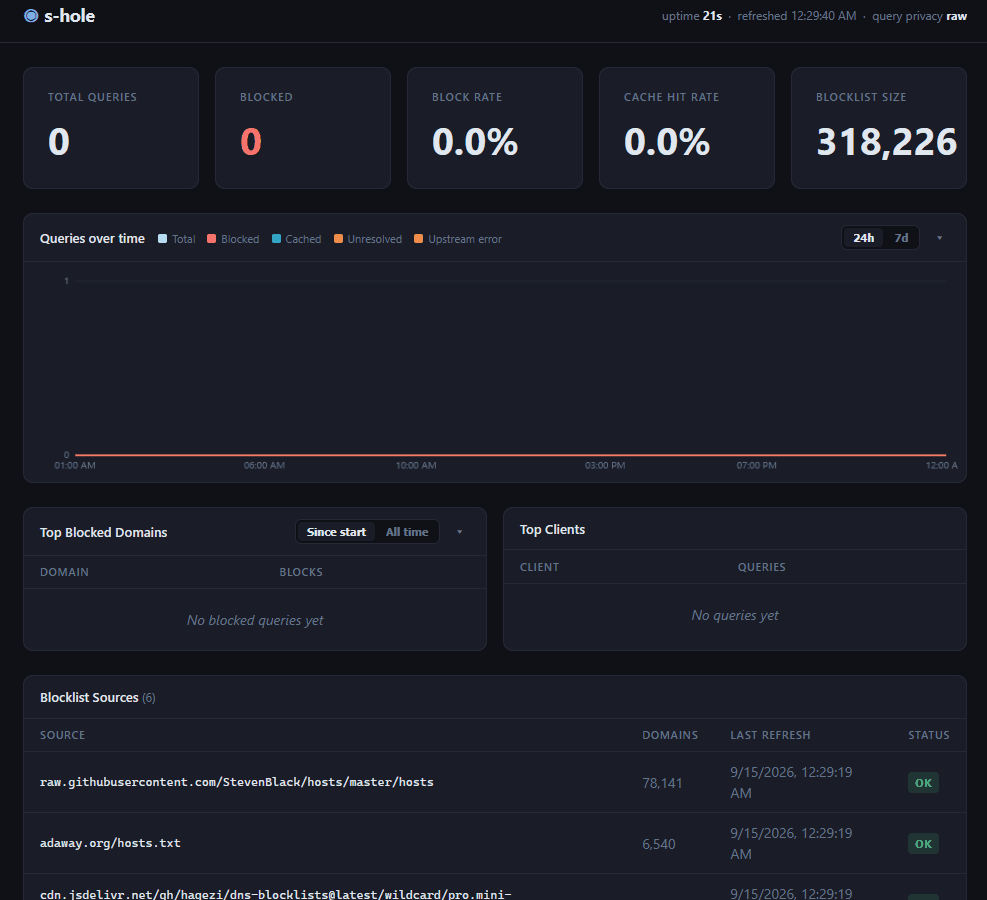

# s-hole

[](https://github.com/lcsabi/s-hole/actions/workflows/ci.yml)
[](https://github.com/lcsabi/s-hole/releases/latest)
[](https://pkg.go.dev/github.com/lcsabi/s-hole)
[](go.mod)
[](LICENSE)

A privacy-first, self-contained DNS sinkhole for network-wide ad and tracker blocking. By default it records no queries and no device addresses, and it sends its upstream queries encrypted, over DNS-over-HTTPS. Deploy it on any always-on machine, point your router's DHCP DNS field at it, and every device on the network is protected, with no per-device configuration required.

s-hole is intentionally small: a single binary, a single YAML config file, no runtime dependencies. The full codebase fits comfortably in an afternoon's reading.



### Contents

- [Features](#features)
- [Scope & limitations](#scope--limitations)
- [Privacy](#privacy): what s-hole records, and how to delete it
- [Quick Start](#quick-start) (incl. [Keep the s-hole host off s-hole](#keep-the-s-hole-host-off-s-hole))
- [Configuration](#configuration) (incl. [env-var overrides](#environment-variable-overrides), [local names](#local-names-printer-naslan), and [DNS over TLS](#dns-over-tls-android-private-dns))
- [REST API](#rest-api)
- [Deployment](#deployment): [Linux/Pi](#raspberry-pi--linux-systemd), [Docker](#docker), [Windows](#windows-system-service)
- [Troubleshooting](docs/TROUBLESHOOTING.md): which log lines to look for when something does not work
- [Building from Source](#building-from-source)
- [Engineering highlights](#engineering-highlights): the code and the process
- [Architecture](#architecture)
- [Development](#development): targets, coverage, CI, fuzz, integration test
- [Security Notes](#security-notes)
- [License](#license)

For the full list of what s-hole stores, where, and for how long, see [`PRIVACY.md`](PRIVACY.md).

For maintainer-facing material, see `docs/DESIGN.md` (design rationale), `docs/CL.md` (change-list index → `docs/cls/`), `docs/BUGS.md` (bug tracker with priorities and root-cause records), `docs/CHANGELOG.md` (release notes), `docs/ROADMAP.md` (planned work and non-goals), and `CONTRIBUTING.md`.

---

## Features

- **Network-wide blocking.** Blocks ads and trackers at the DNS layer, before any connection is established.
- **Private by default.** A fresh install records no queries and no device addresses, keeps no query history, and sends its upstream queries encrypted. Every setting that records more is an opt-in, and s-hole logs a warning for it at startup and with every stats line. See [Privacy](#privacy).
- **Subdomain (suffix) blocking.** A blocked domain blocks its whole subtree, so `ads.example.com` also covers `x.ads.example.com`. Trackers cannot dodge a list entry by rotating subdomains.
- **Community blocklists.** Downloads and auto-refreshes hosts-file, plain-domain, or wildcard (`*.example.com`) lists from any URL.
- **DNS response cache.** Serves repeat queries from memory. Typical cache hit rates of 40–70% reduce upstream load and latency.
- **Encrypted, resilient upstream forwarding.** Forwards over DNS-over-HTTPS (DoH) to Quad9, then Cloudflare, by default. For a public name, plain DNS is a fallback that s-hole uses only when every DoH upstream fails, and it warns when it does. Skips recently-failed resolvers until they recover.
- **LAN only.** Answers clients on the local network only and refuses every other source, so s-hole cannot become an open resolver.
- **DNS over TLS for LAN clients.** An optional encrypted listener (usually port 853). Android 10 and later phones in the default Automatic Private DNS mode use it on their own, so their DNS queries cross the Wi-Fi encrypted. Off by default. You supply the certificate, and a reload picks up a renewed one without a restart.
- **Local reverse DNS.** Answers PTR queries for the private and special ranges (`10/8`, `172.16/12`, `192.168/16`, `100.64/10`, loopback, link-local, IPv6 ULA, and the others in RFC 6303) and for the LAN's own public IPv6 prefix locally, so internal LAN addresses do not go to the upstream resolver. On by default.
- **Local names stay local.** Names that only mean something on your network, such as `printer`, `nas.lan`, or `router.home.arpa`, go only to an upstream on the LAN (your router), never to a public resolver. `localhost` gets the loopback address, and `.onion`, `.invalid`, and `.alt` names get "no such name", without a query upstream.
- **Minimal upstream query.** s-hole sends the upstream a new query with only the question and a few flags. The device's own query ID and EDNS options, such as a cookie that identifies the device, or a Client Subnet (part of its address), stay on the LAN. DoH queries are padded, so their size does not show the name.
- **Optional query history.** When you turn it on, a SQLite database keeps the queries for 7 days by default (retention erases the rows from the file, not only from the table), and an optional text log suits `grep` and `tail`. One command, or a dashboard button on the s-hole host, deletes everything s-hole stored.
- **Admin web UI.** Live stats, a queries-over-time graph (counts only, kept in memory, following `query_log.mode`), what s-hole records and the warnings in effect, top blocked domains, top clients, per-source blocklist health, and, with the history on, a searchable recent query log. Also allowlist management and a "why is this blocked?" domain check.
- **REST API.** All UI data is available as JSON, ready for scripting and future integrations.
- **Observability.** Serves Prometheus metrics at `/metrics` (query, cache, blocklist, upstream-failure, DoT-certificate, and Go-runtime health) and liveness and readiness probes at `/healthz` and `/readyz`, with no external metrics library. Ready-made Grafana dashboard and Prometheus scrape/alert examples ship under `deploy/`.
- **Configurable sinkhole mode.** Returns `0.0.0.0` (the default, a silent failure) or `NXDOMAIN`.
- **Cross-platform.** A single binary for Windows, Linux x86-64, Linux arm64 (Pi 3/4/5 with a 64-bit OS), and Linux armv7 (32-bit OS).
- **Windows Service.** Installs as an auto-start system service with one command. The service runs under its own low-privilege account.
- **Linux systemd.** Ships a hardened unit file with `CAP_NET_BIND_SERVICE`, so it needs no root at runtime.
- **Docker.** A multi-stage image of about 34 MB (amd64, on disk) that runs as an unprivileged user.

---

## Scope & limitations

- **DNS blocking is domain-granular.** It blocks third-party ad and tracker
  networks and device telemetry well, but it cannot touch ads served from the
  same domain as the content. Run a browser content blocker alongside it for
  the first-party and element-level filtering it cannot do.
- s-hole matches on the queried name and does not follow CNAME chains, so a
  cloaked tracker disguised as a first-party subdomain can slip past a
  blocklist entry. Following those chains (CNAME deep-inspection) is on the
  roadmap.
- **Faster browsing comes from blocking, not acceleration.** s-hole usually
  makes pages feel faster because the browser has less to load, not because
  your network is faster. A blocked ad or tracker domain returns `0.0.0.0`, so
  the browser never fetches that content. Repeat DNS lookups return from the
  in-memory cache with no upstream round-trip. The effect is largest on
  ad-heavy pages and low-end devices.
- **It is not a content cache.** s-hole answers DNS only. A first-time lookup
  of an allowed domain still forwards upstream through s-hole. This adds a
  small hop on a healthy LAN, but it is not faster than a direct query. s-hole
  never caches or proxies the pages you visit, so it cannot speed up
  first-party content or raise your bandwidth.

---

## Privacy

s-hole sees every DNS query on your network, so it could hold the browsing history of everyone in the household. It is built to keep as little of that as possible:

- **Nothing is recorded by default.** `query_log.mode` is `"none"`: s-hole keeps no query history, writes no query lines, and the Top Domains and Top Clients panels stay empty. The dashboard still shows the live counters since startup. The per-minute graph follows `query_log.mode` like the Top lists, so it is off under `"none"`.
- **No device addresses by default.** `query_log.clients` is `"drop"`: when you turn the history on, s-hole still does not record which device asked.
- **Limited history.** With the history on, rows older than 7 days are deleted (`query_log.retention_days`), and the database overwrites deleted rows.
- **Encrypted upstreams.** The default upstreams are DoH (Quad9, then Cloudflare), so your internet provider cannot read the queries s-hole forwards.
- **Minimal upstream queries.** The upstream gets only the name, the type, and a few protocol flags. s-hole removes the device's EDNS options (a cookie, a Client Subnet) and query ID, and sends no cookie of its own.
- **Local names stay on the LAN.** s-hole sends local names (`printer`, `nas.lan`, `.local`, `home.arpa`, and the domains in `dns.local_domains`) only to an upstream on the LAN. If no upstream is on the LAN, it answers "no such name".
- **Loud warnings.** Each setting that records more than the default (and a few other less private or less secure settings) gives a WARN at `-check-config`, at startup, and again with every stats line, and appears on the dashboard. You cannot turn these warnings off; change the setting to remove one.
- **LAN only.** s-hole answers devices on the local network only.
- **No cache-only queries.** s-hole refuses a query that reads only the cache (RD=0). So a device that checks whether another device queried a name also puts that name in the cache. `PRIVACY.md` says what a device can still learn from the cache.

The network owner decides what s-hole records, and everyone who uses the network has to trust that person. If you turn on more recording, tell the people who use your network.

**Devices with their own encrypted DNS.** Some devices and apps send DNS queries encrypted to their own provider: Firefox with DNS over HTTPS, iCloud Private Relay, or Android Private DNS set to another provider. s-hole does not see those queries, so it cannot block ads or trackers for them. s-hole does not try to stop these features, because the person who turned one on chose that privacy.

### Delete the query history

To delete everything s-hole stored, run on the s-hole host:

```bash
s-hole -purge -config /etc/s-hole/config.yaml     # sudo for the systemd install
```

On the s-hole host, the dashboard's **Delete history** button does the same. When s-hole runs, it deletes the history through the running process, so the data in memory goes too. When s-hole is stopped, the command deletes the files itself. Relative paths in the config then start in the current directory, so run the command in s-hole's working directory. For the systemd install: `sudo sh -c 'cd /var/lib/s-hole && s-hole -purge -config /etc/s-hole/config.yaml'` (the directory is readable by the `s-hole` user only, so a plain `cd` fails). On Windows, s-hole uses the folder of `config.yaml`. If the query database or the query log file is not there, the command says `not found at` with the path it tried, and names the directory that relative paths start in. If no downloaded blocklist is there, it says `none found in` with the directory; the lists hold no personal data, so this gives no note.

A purge deletes the query database rows, the query log file, the downloaded blocklists (the next reload downloads them again), the Top Domains and Top Clients lists, the per-minute graph, and the DNS response cache. It keeps the allowlist, which is configuration, and the since-start counters, which are counts only. It cannot delete what went to standard output: those lines are in the system journal or the container log.

When you change a setting to record less, the rows that s-hole already stored keep what they held. s-hole warns about them and names the date retention removes them. To remove them at once, purge.

The history can also live on in backups. A backup of `/var/lib/s-hole` (or a VM snapshot, or an SD-card image) keeps the query database as it was, outside retention and purge. On flash storage, only disk encryption makes sure deleted data cannot be recovered from the medium. See [`PRIVACY.md`](PRIVACY.md) for every place s-hole stores data.

---

## Quick Start

### Prerequisites

- Go 1.26 or later (for building from source)
- Port 53 available (requires Administrator on Windows, root or `CAP_NET_BIND_SERVICE` on Linux)

### Install a pre-built release

Each tagged release attaches a per-target archive and a `SHA256SUMS` file to the
[GitHub Releases page](https://github.com/lcsabi/s-hole/releases). Download the
archive for your platform (`linux_amd64`, `linux_arm64`, `linux_armv7`, or
`windows_amd64`), then verify and unpack it:

```bash
sha256sum -c SHA256SUMS --ignore-missing   # confirm the download
tar -xzf s-hole_v2.0.1_linux_amd64.tar.gz  # Linux (unzip the .zip on Windows)
```

Each archive contains the binary, a sample `config.yaml`, `LICENSE`, `README.md`, `PRIVACY.md`,
and (on Linux) the `deploy/` install scripts and systemd unit. The same tag also
publishes a container image. See [Docker](#docker) for the pull command.

### Install via the Go toolchain

If your `$GOBIN` is on `PATH`, the latest commit can be fetched with:

```bash
go install github.com/lcsabi/s-hole/cmd/s-hole@latest
```

### Run interactively

```bash
# Build from a local clone
go build -o s-hole ./cmd/s-hole

# Run (requires elevated privileges for port 53)
sudo ./s-hole -config config.yaml          # Linux / macOS
.\s-hole.exe -config config.yaml           # Windows (Administrator)
```

On first run, s-hole downloads the blocklists (~80 000 domains with the default lists, and the exact count shifts as the upstream lists evolve) and caches them to disk. Later starts skip the download when the cache is less than 24 hours old. Every reload (the `refresh_interval` timer, the dashboard's Reload button, `POST /api/reload`, SIGHUP) downloads again.

Each source download is capped at 256 MiB. Real blocklists are far smaller, so hitting the cap means a wrong URL or a broken source. If a source exceeds the cap, s-hole logs a WARN, keeps serving the previous cached copy of that source (marked stale), and does not replace it with the truncated download.

### Point your router at it

In your router's DHCP settings, set the **DNS Server** field to the IP address of the machine running s-hole. All devices on the network get the new DNS server on their next DHCP renewal (or immediately after they reconnect).

Do not add a public resolver (such as `1.1.1.1`) as a second DNS server in the router. Devices use the second server too, at random, and those queries bypass s-hole's blocking. If you want a fallback, run a second s-hole and add its address.

> **IPv6 networks:** on a dual-stack LAN, routers typically advertise a
> DNS server over IPv6 as well (via RA/RDNSS or DHCPv6), and many
> clients *prefer* it. If that advertisement still points at the router
> or your ISP, dual-stack devices will quietly bypass s-hole for most
> queries and the ads come back. Either disable the router's IPv6 DNS
> advertisement, or give the s-hole machine a stable IPv6 address and
> advertise that instead (s-hole listens on IPv6 by default via
> `dns.listen: ":53"`).

### Keep the s-hole host off s-hole

After the router change, DHCP also gives s-hole's address to the machine that runs s-hole. Do not let the s-hole host use s-hole as its own DNS server. While s-hole is down (a restart, an upgrade, a crash), that host could not resolve any name:

- s-hole could not download its blocklists at startup.
- `apt` and other updates would fail, including the update that would fix s-hole.
- A host without a battery-backed clock (a Raspberry Pi 4 or older) could not reach its time server. With a wrong clock, the DoH upstreams' certificates do not check, and s-hole cannot resolve at all.

So set the s-hole host's own resolver by hand, before you change the router. Use your router's address, unless the router itself forwards its DNS to s-hole; then use a public resolver such as `9.9.9.9`. s-hole checks this at startup and every hour. When it finds the host pointing at itself, it warns once (`this host uses s-hole as its own DNS server`), and again after the setting changes back and forth. The installer checks it too.

**Raspberry Pi OS (bookworm) and Debian with NetworkManager** (tested on a Raspberry Pi 5 and on Debian 13):

```bash
nmcli -t -f NAME,DEVICE connection show --active          # find the connection name and device
sudo nmcli connection modify "<connection>" ipv4.ignore-auto-dns yes ipv4.dns "192.168.1.1" ipv6.ignore-auto-dns yes
sudo nmcli device reapply <device>                         # applies it without a reconnect
grep nameserver /etc/resolv.conf                           # shows 192.168.1.1
```

With `systemd-resolved` on top of NetworkManager, check with `resolvectl status` instead.

**systemd-networkd** (untested): add to the `[Network]` section of the interface's `.network` file, then run `sudo networkctl reload`:

```ini
DNS=192.168.1.1
[DHCPv4]
UseDNS=false
```

**ifupdown with dhclient** (classic Debian server, untested): add to `/etc/dhcp/dhclient.conf`, then renew the lease (`sudo dhclient -r <iface> && sudo dhclient <iface>`):

```
supersede domain-name-servers 192.168.1.1;
```

**Docker host:** the container has its own resolver settings, so set the host's resolver as above.

**Windows** (PowerShell as Administrator, untested):

```powershell
Get-NetAdapter                                             # find the adapter name
Set-DnsClientServerAddress -InterfaceAlias "Ethernet" -ServerAddresses 192.168.1.1
```

### Verify it works

With `nslookup` (preinstalled on Windows and macOS):

```
nslookup doubleclick.net <s-hole-ip>
# expected: Address: 0.0.0.0

nslookup google.com <s-hole-ip>
# expected: a real IP address
```

Or with `dig` (`apt install dnsutils` / `dnf install bind-utils`):

```
dig @<s-hole-ip> doubleclick.net +short   # expected: 0.0.0.0
dig @<s-hole-ip> google.com +short        # expected: a real IP address
```

These commands address s-hole explicitly, so they work even before the
router change above. Network-wide blocking begins only after DHCP hands
out s-hole's address and clients renew their leases. Then devices are
filtered without naming the server.

If a query times out, look at the **Total Queries** card on the dashboard
(or `shole_queries_total` on `/metrics`): it goes up for every query that
reaches s-hole. If it does not go up, the query never arrived: look at the
network path (firewall, wrong IP, client tool) rather than at s-hole. If it
goes up but the query fails, look for the `queries could not be resolved`
line, which s-hole logs once a minute while queries fail
(`journalctl -u s-hole | grep 'could not be resolved'` under systemd). To
see each query for a short time, set `query_log.mode: "all"` and
`query_log.file: "stdout"`, restart, and set them back when you are done
(s-hole warns while they are on).

---

## Configuration

All configuration lives in `config.yaml`, in four sections (`dns`, `blocking`, `query_log`, `admin`) plus `stats_interval`. Every setting has a default, and the defaults are the most private choice. An empty file is valid. The sample `config.yaml` explains each setting.

**When a value is wrong.** s-hole does not stop for a mistake in the config, and a mistake never makes it less private. For an unknown key, a key renamed in s-hole 2.0, or an invalid value, s-hole logs a WARN (`config problem`) and uses the default for that setting. `s-hole -check-config -config config.yaml` reports every problem and exits 1, so check the file before a restart. Only three mistakes stop startup, because nothing can work without the setting: a malformed `dns.listen`, an upstream list in which every entry is malformed, and a DoT certificate pair that cannot load while DoT is on.

**Privacy and security warnings.** A setting that is less private or less secure than its default is a choice, not a mistake. s-hole logs a WARN for it (`privacy warning`) at `-check-config` and at startup, repeats all of them in one line (`privacy and security warnings in effect`) with every stats line, and lists them on the dashboard. These warnings cannot be turned off. The "Warns" column below lists when each setting warns.

| Setting | Default | Allowed values | What it does | Warns |
|---|---|---|---|---|
| `dns.listen` | `":53"` | `host:port` | Address and port for DNS over UDP and TCP. `":53"` is every interface, IPv4 and IPv6. Malformed: s-hole does not start | |
| `dns.dot_listen` | `"off"` | `"off"` or `host:port` | DNS over TLS listener, usually `":853"`. See [DNS over TLS](#dns-over-tls-android-private-dns). Malformed: DoT stays off | |
| `dns.dot_cert`, `dns.dot_key` | none | file paths | PEM certificate and key for DoT, read again on every reload. Required while DoT is on; a pair that does not load stops startup | |
| `dns.upstreams` | Quad9 DoH, Cloudflare DoH, Quad9 plain, Cloudflare plain | `IP:port`, or `https://IP/path` | Resolvers, tried in order. A DoH entry needs an IP host and a path, and no user name or password. A malformed entry is dropped; if all are malformed, s-hole does not start | when no entry is DoH |
| `dns.cache_entries` | `2000` | whole number ≥ 0 | Size of the DNS response cache; `0` turns it off | |
| `dns.local_ptr` | `true` | `true`, `false` | Answer reverse lookups locally instead of upstream: for the private and special ranges (RFC 6303, RFC 6598) and for the public IPv6 prefix of the s-hole host's LAN | when `false` |
| `dns.local_domains` | none | domains, such as `home.example` | More local domains, added to the built-in ones (`.lan`, `.local`, `home.arpa`, `fritz.box`, single-label names, and others). s-hole sends a name under one of them only to an upstream on the LAN. An invalid entry is dropped | |
| `blocking.lists` | none (the sample has two) | URLs | Blocklists: hosts-file, one domain per line, or `*.example.com` lines. A list in another format (such as Adblock) gives a WARN | for an `http://` URL |
| `blocking.allowlist` | none | domains | Domains never blocked, with their subdomains. An invalid entry is dropped | |
| `blocking.reply` | `"zero_ip"` | `"zero_ip"`, `"nxdomain"` | Answer for a blocked query: `0.0.0.0`/`::`, or "no such name" | |
| `blocking.reply_ttl_seconds` | `300` | `0` to `4294967295` | TTL of a blocked answer; `0` tells clients not to cache it | |
| `blocking.refresh_interval` | `"24h"` | positive duration | How often to download the blocklists again | |
| `blocking.cache_dir` | `"."` | directory | Where downloaded blocklists are kept, so a restart does not download them. s-hole creates the directory (mode `700`) if it does not exist | |
| `query_log.mode` | `"none"` | `"none"`, `"blocked"`, `"all"` | Which queries s-hole records, in the database, the log file, and the Top lists | when not `"none"` |
| `query_log.clients` | `"drop"` | `"drop"`, `"subnet"`, `"full"` | How much of the client address a recorded query keeps: nothing, IPv4 /24 and IPv6 /64, or all of it. While the mode records queries, the allowlist audit line masks the requester the same way | when not `"drop"` and mode is not `"none"` |
| `query_log.database` | `"off"` | `"off"` or a file path | SQLite file for the query history (Recent Queries, Stored list, 7-day graph) | |
| `query_log.file` | `"off"` | `"off"`, `"stdout"`, or a file path | Where one text line per recorded query goes. s-hole cannot delete lines on standard output, and does not shorten a file | when not `"off"` and mode is not `"none"` |
| `query_log.retention_days` | `7` | whole number ≥ 0 | Delete database rows older than this; `0` keeps them forever | when `0` or more than `7`, with a database and mode not `"none"` |
| `query_log.flush_interval` | `"30s"` | positive duration | How often recorded queries are written to the database | |
| `query_log.client_names` | none | map of IP or CIDR to a label | Labels for clients on the dashboard. A label never shows more than `clients` keeps. An invalid key is dropped | |
| `admin.listen` | `"127.0.0.1:8080"` | `host:port` | Address of the dashboard and API, which have no login | when not a loopback address |
| `admin.pprof` | `false` | `true`, `false` | Expose the Go profiler under `/debug/pprof/` | when `true` |
| `stats_interval` | `"5m"` | positive duration | How often the stats line (the uptime, no query counts) and the warnings line are logged | |

Except where the table says otherwise, an invalid value gives a `config problem` WARN and the default. A duration uses Go syntax: `30s`, `5m`, `24h`, `168h`. A true/false value also accepts `yes`/`no` and `1`/`0`.

### Minimal config example

```yaml
blocking:
  allowlist:
    - "api.example.com"
query_log:
  mode: "blocked"          # record blocked queries (s-hole warns)
  database: "queries.db"   # keep them for 7 days
```

### Environment variable overrides

An `S_HOLE_*` environment variable overrides one scalar setting. Its name is `S_HOLE_` plus the key path in upper case, with dots as underscores: `S_HOLE_DNS_LISTEN`, `S_HOLE_QUERY_LOG_MODE`, `S_HOLE_ADMIN_LISTEN`, `S_HOLE_STATS_INTERVAL`. Lists and maps (`dns.upstreams`, `dns.local_domains`, `blocking.lists`, `blocking.allowlist`, `query_log.client_names`) have none. An invalid value gives a `config problem` WARN, and the setting keeps its YAML value or default. A variable name from s-hole 1.x (such as `S_HOLE_API_LISTEN`) also gives a WARN that names the new one, and is ignored.

Two more variables are not settings:

| Variable | Effect |
|---|---|
| `S_HOLE_LOG_FORMAT` | Log format: `text` (default) or `json`. Under systemd, each line also starts with its syslog priority, and text lines have no `time=` field, because journald records the time |
| `S_HOLE_ASCII_BANNER` | set to `1` to use ASCII box-drawing on the startup banner |

### Recommended config for Raspberry Pi

The defaults suit a Pi. If you turn the query history on:

```yaml
dns:
  cache_entries: 5000          # more cache, fewer upstream queries
query_log:
  mode: "blocked"              # record blocked queries only, fewer writes
  database: "queries.db"
  flush_interval: "60s"        # write to the SD card less often
```

On a Raspberry Pi 4 or older (no battery-backed clock), keep the plain fallback upstreams, or make sure the Pi does not use s-hole as its own resolver (see [Keep the s-hole host off s-hole](#keep-the-s-hole-host-off-s-hole)).

### Local names (printer, nas.lan)

Some names only mean something on your network: a single-label name such as `printer`, and names under `.lan`, `.home`, `.local`, `.internal`, `home.arpa`, `.localdomain`, `fritz.box`, and a few others. Usually your router answers them from its list of devices. s-hole sends these names only to an upstream with a LAN address, never to a public resolver. A LAN address is a private, loopback, or link-local address, or an IPv6 address in a subnet of the s-hole host. If no upstream is on the LAN, s-hole answers "no such name" and logs `no upstream on the LAN` at startup.

To resolve local names, add your router to the upstreams, after the DoH entries. s-hole then sends public names to DoH as before, and local names to the router only:

```yaml
dns:
  upstreams:
    - "https://9.9.9.9/dns-query"
    - "https://1.1.1.1/dns-query"
    - "9.9.9.9:53"
    - "1.1.1.1:53"
    - "192.168.1.1:53"          # the router: local names, and public names only if every entry above fails
  local_domains:
    - "home.example"            # the router's own domain, if it is not built in
```

If your router uses another domain for its devices, add it to `dns.local_domains`. `fritz.box` (AVM FRITZ!Box) is built in. At startup, s-hole logs `a search domain of this host is not a local domain` for each search domain of the s-hole host (from `/etc/resolv.conf` and `/run/systemd/resolve/resolv.conf`) that is not a local domain. The router usually gives the same search domain to every device. s-hole does not add it on its own, because a search domain can be a public domain. On Windows, s-hole does not check the search domains. If the router sends its own DNS queries to s-hole, do not add it as an upstream: each local name would then go round in a loop until it times out. An upstream on the LAN decides itself what it does with a name it does not know. Many routers forward it to the internet provider, and a resolver on the s-hole host (such as Unbound on `127.0.0.1`) asks the public DNS.

s-hole answers some names itself and never sends them anywhere: `localhost` and names under it get the loopback address, and names under `.onion`, `.invalid`, and `.alt` get "no such name".

### DNS over TLS (Android Private DNS)

s-hole can serve DNS over TLS (DoT, RFC 7858), usually on port 853. It is off by default.

The main use is Android's **Automatic** Private DNS mode, the default on most phones. In this mode the phone tries DoT on the network's DNS server and, when it answers, sends its queries to s-hole encrypted. The phone does not check the certificate in this mode, so a self-signed certificate is enough and the phone needs no setup. This stops other devices on the Wi-Fi from reading DNS queries. It does not protect against an impostor resolver, because the certificate is not checked.

s-hole accepts TLS 1.3 only. In TLS 1.2, a resumed session sends its session ticket in clear text, so an observer on the Wi-Fi could link the DoT connections of one phone. Android 10 and later support TLS 1.3. Android 9 cannot use s-hole's DoT: in Automatic mode it sends plain DNS to s-hole, and in strict mode it cannot resolve names.

> **Test status.** The listener, certificate reload, and certificate status were tested with automated tests, `dig +tls`, and `openssl s_client`, and on a Debian 12 VM with `systemd-resolved` as the DoT client in both modes. Automatic mode was tested on Bliss OS 16.9.7 (Android 13) in VirtualBox, not on a phone: Android found DoT on the DHCP DNS server, accepted the self-signed certificate, and s-hole blocked its lookups over DoT. In strict mode, the same Android rejected a certificate that the user installed, both a self-signed certificate and a CA. The public-certificate route in strict mode was not tested. These tests ran while TLS 1.2 was the floor. After CL 102 made TLS 1.3 the floor, Automatic mode was tested again on the same Android 13 VM, and it validated and used DoT over TLS 1.3. `systemd-resolved` 257 on Debian 13 was tested again in both modes, also over TLS 1.3.

**1. Make a certificate.** s-hole serves one certificate to every DoT client. Phones in Automatic mode accept any certificate, so a self-signed one is enough. If you also have desktop DoT clients, make the certificate with mkcert instead (see [Other DoT clients](#other-dot-clients)); phones accept that one too. Put the hostname and the LAN IP of the s-hole box in the certificate:

```bash
openssl req -x509 -newkey ec -pkeyopt ec_paramgen_curve:prime256v1 -nodes \
  -days 3650 -keyout key.pem -out cert.pem -subj "/CN=dns.home" \
  -addext "subjectAltName=DNS:dns.home,IP:192.168.1.10" \
  -addext "basicConstraints=critical,CA:FALSE"
```

Automatic mode does not check the expiry, so a long validity saves renewals. `CA:FALSE` stops the certificate from acting as a CA. Without it, OpenSSL makes a CA whose key is on the s-hole box, and a device that trusted it would accept a certificate for any website signed with that key.

**2. Install the files** in `/etc/s-hole/`. The service user cannot read home directories.

```bash
sudo install -m 644 -o root -g s-hole cert.pem /etc/s-hole/cert.pem
sudo install -m 640 -o root -g s-hole key.pem  /etc/s-hole/key.pem
```

**3. Turn DoT on** in `/etc/s-hole/config.yaml`, then validate the file and restart. Run the check as the `s-hole` user: only root and the `s-hole` group can read the config and the key, and the check then also proves that the service can read them.

```yaml
dns:
  dot_listen: ":853"
  dot_cert: "/etc/s-hole/cert.pem"
  dot_key: "/etc/s-hole/key.pem"
```

```bash
sudo -u s-hole s-hole -check-config -config /etc/s-hole/config.yaml
sudo systemctl restart s-hole
```

If the port is in use or the certificate does not load, s-hole stops with an error.

**4. Check it.** With `dig` from BIND 9.18 or later, a blocked domain returns `0.0.0.0`:

```bash
dig +tls +tls-ca=cert.pem +tls-hostname=dns.home @192.168.1.10 -p 853 doubleclick.net
```

To see phones use it, run `sudo tcpdump -ni any tcp port 853` on the s-hole box while a phone in Automatic mode browses. Traffic on port 853 means the phone uses DoT. Some port 53 queries continue (for example `connectivitycheck.gstatic.com`): Android's network check does not use Private DNS, by design.

**Watch and renew.** The dashboard header shows a certificate badge (OK, EXPIRES SOON, EXPIRED, or RELOAD FAILED). `/metrics` and the example alerts in `deploy/prometheus-alerts.yml` cover the same state. To renew, replace the two files and reload: `sudo systemctl reload s-hole`, the dashboard reload button, `POST /api/reload`, or SIGHUP. If the new files do not load, s-hole keeps the current certificate.

**Docker.** Put the files in `data/` (the container sees them as `/app/cert.pem` and `/app/key.pem`) and make them readable by user 65532 (`sudo chown 65532:65532 data/cert.pem data/key.pem`). With host networking DoT needs no port mapping; in the bridge variant, publish the port (`-p 192.168.1.10:853:853/tcp`). Reload with `docker kill -s HUP s-hole`.

#### Strict mode (optional)

A phone set to **Private DNS provider hostname** uses only DoT to that host and checks its certificate. Use strict mode when you want certificate checks, or when a phone must not fall back to plain DNS. It needs more setup than Automatic mode:

- **A domain you own**, such as `dns.example.com`. A cheap domain or a free dynamic-DNS subdomain works if the provider supports the DNS-01 challenge.
- **A publicly trusted certificate** for that name, for example from Let's Encrypt with DNS-01 (the box does not have to be reachable from the internet). Android ignores a certificate or CA that you install yourself (tested on Android 13).
- **A public A record** that points the name at the s-hole box's LAN IP. The phone looks up the name through plain DNS, and s-hole cannot answer a LAN name itself yet (ROADMAP #15).

Then enter the name in Settings → Network & internet → Private DNS → Private DNS provider hostname (the path varies by phone). Two limits:

- Away from home the name points at an unreachable LAN address, so the phone has no DNS. Switch back to Automatic when you leave.
- A router with DNS rebind protection drops a public name that points at a private IP. A phone that uses s-hole directly as its DNS server is not affected.

<details>
<summary>Renewing a Let's Encrypt certificate with certbot</summary>

Certbot keeps its keys where only root can read them, so copy them with a deploy hook. Make the script executable, and run it once by hand after the first issuance (certbot runs deploy hooks only on renewal).

```sh
#!/bin/sh
# /etc/letsencrypt/renewal-hooks/deploy/s-hole.sh
install -m 644 -o root -g s-hole "$RENEWED_LINEAGE/fullchain.pem" /etc/s-hole/cert.pem
install -m 640 -o root -g s-hole "$RENEWED_LINEAGE/privkey.pem"   /etc/s-hole/key.pem
systemctl reload s-hole
```

</details>

#### Other DoT clients

Desktop support for DoT varies. The two `systemd-resolved` rows were tested against s-hole on Debian 12, and again on Debian 13 (systemd 257) with TLS 1.3 only. The other rows come from each client's documentation and are untested.

| Client | DoT to s-hole | Certificate |
|---|---|---|
| Linux, `systemd-resolved` with `DNSOverTLS=opportunistic` | Yes | Any; the client does not check it |
| Linux, `systemd-resolved` with `DNSOverTLS=yes` | Yes | Must be trusted: the self-signed certificate itself, the mkcert CA, or a public certificate |
| Linux, stubby | Yes | Must be trusted |
| macOS 11+, iOS 14+ | Yes, through a configuration profile with a DNS settings payload | Must be trusted |
| Windows 11 | No: its built-in encrypted DNS is DoH only | n/a |
| Browsers | No: they support DoH only | n/a |

For `systemd-resolved` (on Debian 12, install the `systemd-resolved` package first), create `/etc/systemd/resolved.conf.d/s-hole.conf`:

```ini
[Resolve]
DNS=192.168.1.10#dns.home
DNSOverTLS=opportunistic
Domains=~.
```

Then run `sudo systemctl restart systemd-resolved`. `resolvectl status` shows `+DNSOverTLS`. `Domains=~.` sends every lookup to this server, ahead of a server that DHCP gives the network link. In opportunistic mode the client falls back to plain DNS when DoT fails.

If you run this on the s-hole box itself, the setting applies only to programs that ask `systemd-resolved`. With the stub listener off, most programs read `/etc/resolv.conf`, which also lists the DHCP servers, and use the next server when s-hole does not answer. s-hole downloads its blocklists at startup before its DNS listener is up, so on its own box this fallback does the download. If s-hole is the box's only DNS server, the download fails: s-hole loads the lists from its on-disk cache, and a fresh install with no cache starts with an empty blocklist until the next reload.

For strict mode, set `DNSOverTLS=yes` and trust the certificate. On Linux, the self-signed certificate from step 1 works as its own trust anchor, so you do not need mkcert:

```bash
sudo cp cert.pem /usr/local/share/ca-certificates/s-hole.crt
sudo update-ca-certificates
sudo systemctl restart systemd-resolved
```

For other clients that check the certificate, or to cover several servers with one CA, use [mkcert](https://github.com/FiloSottile/mkcert): it makes a local CA and issues the certificate (`mkcert -cert-file cert.pem -key-file key.pem dns.home 192.168.1.10`). Use this certificate in place of the openssl one from step 1, because s-hole serves only one. Phones in Automatic mode accept it too. Install only its `rootCA.pem` (in the folder `mkcert -CAROOT` prints) on each client, and never copy `rootCA-key.pem`. A CA that a device trusts can vouch for any website, so install it only on devices you control.

<details>
<summary>How to install <code>rootCA.pem</code> on each client</summary>

| Client | How |
|---|---|
| Debian, Ubuntu | `sudo cp rootCA.pem /usr/local/share/ca-certificates/s-hole-ca.crt`, then `sudo update-ca-certificates`. The file name must end in `.crt`. |
| Fedora, RHEL | `sudo cp rootCA.pem /etc/pki/ca-trust/source/anchors/s-hole-ca.pem`, then `sudo update-ca-trust`. |
| macOS | `sudo security add-trusted-cert -d -r trustRoot -k /Library/Keychains/System.keychain rootCA.pem` |
| Windows | In an Administrator prompt: `certutil -addstore -f Root rootCA.pem` |
| iOS, iPadOS | Send the file to the device and install it in Settings → General → VPN & Device Management, then turn on full trust in Settings → General → About → Certificate Trust Settings. |
| Android | Settings → Security → Encryption & credentials → Install a certificate → CA certificate. Private DNS strict mode ignores it (tested on Android 13); Automatic mode does not need it. |

</details>

---

## REST API

The admin web UI is served at **`http://127.0.0.1:8080`** by default. This is localhost only, so a fresh install is not reachable from the LAN. Set `admin.listen: "0.0.0.0:8080"` in `config.yaml` (or `S_HOLE_ADMIN_LISTEN=...`) to expose it; s-hole then warns, because the dashboard has no login. All data is also available as JSON.

The server answers only requests addressed to an IP address, to `localhost`, or to the machine's own hostname (for example `raspberrypi` or `raspberrypi.local`). A request for any other name gets `421` with a hint. This stops a web page from reading the API through DNS rebinding. A request that a browser marks as sent from another site gets `403`, so a web page cannot use your browser to change the allowlist, to start an export, or to time a reply. A link from another page can still open the dashboard. Scripts and `curl` are not affected. Browsers send this header only to `localhost`, a loopback address, or HTTPS, so the check protects the default `127.0.0.1:8080` bind. It does not protect a dashboard opened by its LAN address over plain HTTP. Every response carries `Cache-Control: no-store`, so the browser does not keep query data on disk.

| Method | Endpoint | Description |
|---|---|---|
| `GET` | `/api/stats` | Live stats: uptime, query totals, block rate, cache hit rate, blocklist size, per-source blocklist health, top domains/clients (each client carries an optional `client_names` `label`), a `privacy` object (`mode`, `clients`, `database`, `file`, `retention_days`), the `warnings` in effect, and a `dot` object with the DNS-over-TLS certificate state (`enabled`, `listen`, `names`, `not_after`, `expires_in_days`, `state` = `ok`/`expiring`/`expired`/`reload_failed`, and the last reload result) |
| `GET` | `/api/check?domain=NAME` | Why a domain is blocked: the decision plus the full suffix walk (matched block entry, overriding allowlist entry). Diagnostic; changes no state and does not count in stats |
| `GET` | `/api/queries?limit=N` | Last N stored queries, newest first (default: 50, max: 1000). Filter with `?domain=` (substring), `?client=` (exact match on the stored value), `?blocked=true`/`false`, or `?outcome=unresolved`/`upstream-error` (failed queries). Each row carries a computed `outcome` (`allowed`/`blocked`/`unresolved`/`upstream_error`) and an optional `client_names` `label`. Empty when `query_log.database` is off |
| `GET` | `/api/queries/export?format=csv` | Download the stored queries. `?format=csv` (default) or `json`, streamed. Reuses the `/api/queries` filters; uncapped unless `?limit=N` is set. The `X-Shole-Query-Log-Clients` and `X-Shole-Query-Log-Mode` headers (and the JSON `clients` and `mode` fields) say what the rows hold. Empty (valid) file when `query_log.database` is off |
| `GET` | `/api/top-blocked?limit=N` | Most-blocked domains in the stored history (default: 50, max: 1000); empty when `query_log.database` is off |
| `GET` | `/api/history?window=24h&bucket=1h` | Per-bucket total, blocked, cached, unresolved, and upstream-error counts. A window up to 24 hours comes from per-minute counts kept in memory (`source: "memory"`), which follow `query_log.mode` (`logging`): all zeros under `"none"`, blocked queries only under `"blocked"`. A longer window comes from the stored history (`source: "database"`) when the database is on and records queries; under `query_log.mode: "blocked"` it holds blocked queries only (`logging: "blocked"`). Bucket count capped at 1000 |
| `GET` | `/api/allowlist` | List every allowlist domain (config and runtime entries) |
| `POST` | `/api/allowlist` | Add a domain. Body: `{"domain": "example.com"}`, with `Content-Type: application/json`. A public suffix such as `co.uk` gets `400`. When the allowlist holds 1,000 entries added this way, a new entry gets `409`; remove one to free a place (the entries in `blocking.allowlist` do not count) |
| `DELETE` | `/api/allowlist?domain=…` | Remove a domain from the allowlist (a config entry too, until a restart) |
| `POST` | `/api/reload` | Trigger an immediate reload: re-read the DoT certificate (when DoT is on), then refresh the blocklists. Single-flight: if a reload is already running, returns `"reload queued"`, and one more reload runs when the current one finishes |
| `POST` | `/api/purge` | Delete everything s-hole stored (see [Delete the query history](#delete-the-query-history)). Body: `{"confirm": true}`, JSON. Accepted only from the s-hole host itself (loopback or one of its own addresses); returns a report of each step |
| `GET`  | `/healthz` | Liveness probe. Always 200 OK while the HTTP server is responsive |
| `GET`  | `/readyz` | Readiness probe. 200 OK once the blocklist has loaded at least one entry, 503 otherwise |
| `GET`  | `/metrics` | Prometheus text exposition of the `shole_*` series: query, cache, blocklist, upstream-failure, forward-limit, refused-query, plaintext-fallback, DoT certificate (when DoT is on), and Go-runtime metrics. See the [Metrics reference](docs/DESIGN.md#metrics-reference) for the full list. |
| `GET`  | `/debug/pprof/*` | Standard Go pprof endpoints. Registered **only** when `admin.pprof: true` is set (or `S_HOLE_ADMIN_PPROF=1`); s-hole warns while it is on. Keep `admin.listen` on localhost while you use it. |

Runtime allowlist changes take effect immediately but do not persist across restarts. To make an allowlist entry permanent, add it to `blocking.allowlist` in `config.yaml`.

---

## Deployment

The Quick Start runs s-hole as a foreground process. It lives exactly
as long as your terminal session and dies with a reboot, a crash, or a
logout. That is fine for evaluation, but once your router points the LAN
at s-hole, every device's internet depends on it. Deployment registers
the binary as a **service**: the operating system (systemd, the Windows
SCM, or Docker's restart policy) starts it at boot, restarts it if it
crashes, and runs it detached from any user session.

If you want the admin dashboard reachable from other devices, set
`admin.listen: "0.0.0.0:8080"` in `config.yaml` **before** installing.
The default binds localhost only, and the UI is unauthenticated, so
LAN exposure is a deliberate opt-in, and s-hole warns while it is on.

### Raspberry Pi / Linux (systemd)

```bash
# Cross-compile on your development machine. Pick the build by the Pi's
# operating system, not by the Pi model: `uname -m` on the Pi says aarch64 for
# a 64-bit OS and armv7l for a 32-bit OS.
make pi          # arm64: a 64-bit OS (Pi 3, 4, 5)
make pi32        # armv7: a 32-bit OS (Pi 2, and Pi 3 or 4 on a 32-bit OS)

# Copy binary, config, and the install/uninstall scripts to the Pi:
scp s-hole-linux-arm64 pi@raspberrypi.local:~/
scp config.yaml pi@raspberrypi.local:~/
scp deploy/install-linux.sh deploy/uninstall-linux.sh pi@raspberrypi.local:~/

# On the Pi, run the installer as root:
sudo bash install-linux.sh ./s-hole-linux-arm64 ./config.yaml
```

The installer creates a `s-hole` system user, places the binary at `/usr/local/bin/s-hole`, installs config to `/etc/s-hole/config.yaml`, creates `/var/lib/s-hole` readable by the `s-hole` user only (and gives back to that user any data that an uninstall kept), and enables the service to start on boot. Before it installs anything, it validates the arguments (so a swapped binary/config pair fails loudly, not silently) and dry-runs the config through the new binary: the installed `/etc/s-hole/config.yaml` if one exists, else the one you pass. On any config problem it stops and changes nothing, so on an upgrade the old build keeps running. To upgrade, run the installer again with the new binary. From s-hole 1.x, follow "Upgrade to 2.0" in `docs/CHANGELOG.md` instead: the installer stops on a 1.x config. Before it starts the service, it warns if `systemd-resolved` is holding port 53. After the start it health-checks the unit: if the service does not come up it prints the last log lines and exits non-zero, so a dead service never looks installed. It ends by printing the installed build's version and commit, and a reminder to [keep the s-hole host off s-hole](#keep-the-s-hole-host-off-s-hole), with a warning if the host already uses itself as its DNS server. Confirm the build matches the binary you meant to ship, because a stale `scp` is otherwise silent.

Run `sudo bash install-linux.sh -h` for the full options, including `--free-port-53` (disable the `systemd-resolved` stub for you when it holds port 53, instead of only warning). After it frees the port, the installer tells you if `/etc/resolv.conf` still points at the disabled stub. In that case the host has no DNS for programs that read that file (including s-hole's blocklist download) until you run `sudo ln -sf /run/systemd/resolve/resolv.conf /etc/resolv.conf`.

After installation:

```bash
sudo systemctl status s-hole     # check running state
sudo systemctl stop s-hole       # stop the service
sudo systemctl start s-hole      # start the service
sudo systemctl restart s-hole    # restart (for example after editing config)
sudo systemctl disable s-hole    # don't start on boot
sudo systemctl enable s-hole     # re-enable autostart
journalctl -u s-hole -f          # follow logs live
journalctl -u s-hole -p warning  # show only warnings and errors
```

If s-hole does not work as you expect, read [docs/TROUBLESHOOTING.md](docs/TROUBLESHOOTING.md). It lists the log lines for the common problems and what to do for each.

To trigger an immediate reload without restarting (Linux/macOS):

```bash
sudo systemctl reload s-hole            # via systemd
sudo kill -HUP "$(pidof s-hole)"        # or directly
```

SIGHUP is honored on every non-Windows platform. It runs the same single-flight reload as `POST /api/reload`. The reload re-reads the DoT certificate and key when DoT is on, then re-downloads the blocklists from the URLs that s-hole read at startup. It does not re-read `config.yaml`. To apply a change to any config value, restart the service.

The systemd unit runs with `CAP_NET_BIND_SERVICE` so it can bind port 53 (and 853 for DNS over TLS) without running as root. `ProtectSystem=strict` and `NoNewPrivileges` are set for defence in depth, and `UMask=0077` makes every file s-hole creates readable by the `s-hole` user only.

#### Operating an installed service

A few things to know once s-hole runs as a systemd service:

- **Config is *copied*, not live-linked.** The installer copies your config to `/etc/s-hole/config.yaml` on the **first** install only. It never overwrites an existing one (it prints `config already exists, skipping`), and re-running the installer or `scp`-ing a new file to your home directory does **not** update it. To apply a config change on an installed host, edit `/etc/s-hole/config.yaml` directly (or `sudo cp your-config.yaml /etc/s-hole/config.yaml`), then `sudo systemctl restart s-hole`. To catch a mistake before the restart, validate the file first with `sudo -u s-hole s-hole -check-config -config /etc/s-hole/config.yaml`, which loads and validates it exactly the way startup does and exits non-zero on any error. A reload (`POST /api/reload` or SIGHUP) does not apply a config edit. It re-downloads from the URLs read at startup and re-reads the certificate files at the `dns.dot_cert` and `dns.dot_key` paths read at startup, so a changed blocklist URL or a changed certificate path also needs a restart to take effect.
- **`S_HOLE_*` environment overrides do not reach the service.** The systemd unit runs with a clean environment, so shell env vars only take effect when you run the binary directly. On the service, put values in `/etc/s-hole/config.yaml` (or add `Environment=` lines to the unit).
- **`query_log.database`, `query_log.file`, and `blocking.cache_dir` are relative to `/var/lib/s-hole`.** Relative paths resolve against the service's working directory. Because the unit sets `ProtectSystem=strict` with `ReadWritePaths=/var/lib/s-hole`, the rest of the filesystem is read-only to the service. Keep these paths under `/var/lib/s-hole` (a relative path such as `queries.db` does). Pointing them at `/tmp` or a home directory fails to write.
- **The query history flushes on an interval.** With `query_log.database` on, newly recorded queries appear in `/api/queries` and the dashboard's Recent Queries panel and Stored list only after the next SQLite flush (`query_log.flush_interval`, default `30s`), not instantly. Lower it for a more responsive view.

To remove s-hole, run the bundled uninstaller as root (from the `deploy/`
directory, or wherever you copied it):

```bash
sudo bash uninstall-linux.sh                     # keep /var/lib/s-hole (query history + caches), owned by root
sudo bash uninstall-linux.sh --purge             # also delete everything s-hole stored
sudo bash uninstall-linux.sh --restore-resolved  # also restore the systemd-resolved stub on :53
```

It stops and disables the service, removes the unit, binary, config
(`/etc/s-hole`), and the `s-hole` system user and group, then prints a summary
of what it removed and kept. `/etc/s-hole` also holds any files you added to it,
such as a DNS-over-TLS certificate and key. The prompt lists them before it
deletes them, so back up a key you have no other copy of. Your query history and blocklist caches in
`/var/lib/s-hole` are kept unless you pass `--purge`; a kept directory goes to
root with mode `700`, because a later system user could get the deleted user's
ID. A later install gives it back to the `s-hole` user. `--purge` first runs `s-hole -purge`, so a query database or log file
outside `/var/lib/s-hole` goes too. In both modes the uninstaller prints how to
clear the system journal, which it does not do itself: that would delete the
logs of every service. `--restore-resolved`
applies only if you had freed port 53 by disabling the `systemd-resolved` stub.
It removes that drop-in and restarts the resolver. The flags combine
(`--purge --restore-resolved` is a full teardown); add `-y` to skip the
confirmation prompt.

### Docker

The image runs s-hole as an unprivileged user (UID 65532). A file capability lets it bind port 53 without root. A `HEALTHCHECK` asks s-hole for `/readyz` every 30 seconds (`s-hole -healthcheck`).

**1. Create a data directory, place your config in it, and give it to UID 65532:**

```bash
mkdir -p data
cp config.yaml data/
sudo chown -R 65532:65532 data
```

The container uses `/app` as its working directory and reads `/app/config.yaml`. Mounting `./data` there keeps the config, the blocklist cache, and a query database (when `query_log.database` is on) on the host across restarts and image upgrades. s-hole creates its files with mode `600`, so only UID 65532 (and root) can read them. To edit the config, use `sudo`.

> **Upgrading from an image older than 2.0?** The older image ran as root, so the files in `data/` belong to root. Run `sudo chown -R 65532:65532 data` once, and move the config to the 2.0 format (see `docs/CHANGELOG.md`). Until you do, s-hole still resolves and blocks, but it logs a WARN with this `chown` command, cannot open the query database, and downloads the blocklists again at each start.

**2. Find the host's LAN IP.**

The machine running s-hole needs a stable LAN address, a static IP or a DHCP reservation, because your router hands it out to every client as the DNS server. Find it:

```bash
ip -4 -o addr show scope global | awk '{print $4}' | cut -d/ -f1   # for example 192.168.1.10
```

**3. Build the image** (or pull a pre-built one):

```bash
docker build -t s-hole .
# Or pull a tagged release instead of building:
#   docker pull ghcr.io/lcsabi/s-hole:2.0.1   (and use that name in step 4)
```

**4. Run with host networking** (recommended on Linux):

Set `dns.listen` to the LAN IP in `data/config.yaml`. Most Linux hosts run `systemd-resolved`, which already holds `127.0.0.53:53`, so `":53"` (every interface) fails with *"address already in use"*; the LAN IP does not collide. (To use `":53"`, free the stub first, as shown below.)

```yaml
dns:
  listen: "192.168.1.10:53"
```

```bash
docker run -d \
  --name s-hole \
  --restart unless-stopped \
  --network host \
  --log-opt max-size=10m --log-opt max-file=3 \
  -v "$(pwd)/data:/app" \
  s-hole
```

With host networking:

- s-hole sees the real address of every client, so the Top Clients panel and the LAN-only check work as on a normal install.
- The default `admin.listen: "127.0.0.1:8080"` works as it is: the dashboard is at `http://127.0.0.1:8080` on the host. For the LAN, set `"0.0.0.0:8080"` (s-hole warns).
- IPv6 clients reach s-hole without extra Docker setup.
- The container shares the host's network stack, so it is less isolated: it can bind any host port.

`--log-opt` limits the container log, which Docker does not rotate by default. With the default `query_log.file: "off"` the log holds no query data.

Point your router's DHCP **DNS Server** field at the LAN IP. Ignore the "Router setup" box that s-hole prints at startup if it shows a different address.

**Bridge networking** (Docker Desktop on Mac or Windows, where host networking does not reach the LAN):

```bash
HOST_IP=192.168.1.10          # the LAN IP from step 2
docker run -d \
  --name s-hole \
  --restart unless-stopped \
  --log-opt max-size=10m --log-opt max-file=3 \
  -p ${HOST_IP}:53:53/udp -p ${HOST_IP}:53:53/tcp \
  -p 127.0.0.1:8080:8080 \
  -v "$(pwd)/data:/app" \
  s-hole
```

In this variant, set `admin.listen: "0.0.0.0:8080"` in `data/config.yaml`: inside the container, `127.0.0.1` answers only the container itself. The `-p 127.0.0.1:8080:8080` mapping keeps the dashboard on the host only; to open it to the LAN, publish it on `${HOST_IP}` instead. Inside a bridge network s-hole sees host-local requests as coming from the bridge gateway (for example `172.17.0.1`), so the dashboard's **Delete history** button does not work there: run `docker exec s-hole s-hole -purge -config /app/config.yaml` instead. On Windows, use a backtick for line continuation and `${PWD}\data:/app` for the volume.

After the first run `./data` looks like this:

```
data/
├── config.yaml             ← your config (you created this)
├── queries.db              ← query history, only with query_log.database on
└── blocklist_*.txt         ← cached blocklist downloads
```

To update config, edit `./data/config.yaml` (with `sudo`) and restart the container:

```bash
docker restart s-hole
```

> **Want s-hole on every interface (`":53"`) instead of one LAN IP?** Then
> the `systemd-resolved` stub has to give up port 53. Turn off *just* the stub,
> not the whole service:
> ```bash
> sudo mkdir -p /etc/systemd/resolved.conf.d
> printf '[Resolve]\nDNSStubListener=no\n' | sudo tee /etc/systemd/resolved.conf.d/no-stub.conf
> sudo systemctl restart systemd-resolved
> ```
> The installer does the same when you pass `--free-port-53`; `uninstall-linux.sh --restore-resolved` reverses it.
> `systemd-resolved` still resolves for local programs that use NSS, but on
> distros where `/etc/resolv.conf` points at `127.0.0.53`, releasing the stub
> leaves anything that reads `resolv.conf` directly without a resolver. Repoint
> `/etc/resolv.conf` afterwards to resolved's upstream list with
> `sudo ln -sf /run/systemd/resolve/resolv.conf /etc/resolv.conf`. Do not point
> it at s-hole (see [Keep the s-hole host off s-hole](#keep-the-s-hole-host-off-s-hole)).

### Windows (system service)

Run once as Administrator to register s-hole as an auto-start Windows Service. Put the binary and the config in a folder of their own, such as `C:\s-hole`:

```powershell
# Install (s-hole stores the config path as an absolute path)
.\s-hole.exe -service install -config C:\s-hole\config.yaml

# Start / stop
.\s-hole.exe -service start
.\s-hole.exe -service stop

# Remove
.\s-hole.exe -service uninstall
```

The service can also be managed through the standard Windows Services panel (`services.msc`) or `sc.exe`.

The service runs as its own virtual account, `NT SERVICE\s-hole`, not as LocalSystem. `-service install` gives the config folder an access list that allows only SYSTEM, the Administrators group, and that account. s-hole writes its data files in that folder, so other users on the PC cannot read the query history. Because of that list, edit `config.yaml` from an editor that runs as Administrator. A service installed with an older version runs as LocalSystem: uninstall and install it again to change that.

`-service install` sets the service to restart 5 seconds after a failure, like `Restart=on-failure` in the systemd unit. A failure is a crash, or a DNS listener that stops with an error while s-hole runs. If you installed the service with an older version, it does not have these restart actions. To add them without a reinstall, run these two commands as Administrator:

```powershell
sc.exe failure s-hole reset= 86400 actions= restart/5000/restart/5000/restart/5000
sc.exe failureflag s-hole 1
```

To see the actions, run `sc.exe qfailure s-hole`.

Windows has no SIGHUP. To reload the blocklists, or a renewed DNS-over-TLS certificate, use the dashboard reload button or `POST /api/reload`.

A service has no console, so s-hole routes its application log (startup,
blocklist refresh, and audit messages) to the Windows Event Log. Read it in
Event Viewer under **Windows Logs > Application**, source **s-hole**. `-service
install` registers the event source and `-service uninstall` removes it. Every
interactive user can read the Application log; with the default settings,
s-hole's log lines hold no query data. Standard output is discarded under the
service, so `query_log.file: "stdout"` writes nothing there; use a file path if
you turn query lines on.

The service starts in the directory of its config file. If a path in the
config is relative (for example `query_log.database`, `blocking.cache_dir`,
`query_log.file`, or `dns.dot_cert`), s-hole looks for the file next to
`config.yaml`. For example, `queries.db` becomes `C:\s-hole\queries.db`.

### Monitoring (Prometheus + Grafana)

s-hole serves Prometheus metrics at `/metrics`, and the built-in dashboard covers
the day-to-day view with no extra software. If you already run Prometheus and
Grafana, the `deploy/` directory has ready-made assets to plug s-hole into that
stack:

- `deploy/prometheus.yml`: an example scrape config for the s-hole target.
- `deploy/prometheus-alerts.yml`: example alert rules (resolver down, empty block
  set, stale source, dropped query-log rows, forward and upstream failures,
  goroutine growth, and, with DNS over TLS on, certificate expiry and failed
  certificate reloads).
- `deploy/grafana-dashboard.json`: a dashboard for the `shole_*` metrics. Import it
  in Grafana (Dashboards > New > Import) and pick your Prometheus data source.

These are optional. They do not replace the built-in dashboard.

The default `admin.listen` binds `127.0.0.1`, so Prometheus must run on the same
host. To scrape from another host, set `admin.listen: "0.0.0.0:8080"` (s-hole
warns) and use the LAN IP as the target: the admin server answers requests
addressed to an IP address, `localhost`, or its own hostname only. Do not
expose `/metrics` to the public internet: the admin API is unauthenticated.

---

## Building from Source

```bash
# Current platform
make

# Cross-compilation targets
make pi          # Linux arm64: a 64-bit OS (Raspberry Pi 3, 4, 5)
make pi32        # Linux armv7: a 32-bit OS (Pi 2, or a Pi 3 or 4 on a 32-bit OS)
make linux       # Linux amd64

# Clean
make clean
```

All targets produce a statically linked binary with debug info stripped (`-ldflags="-s -w"`) and without the build paths (`-trimpath`). No CGO is required, because `modernc.org/sqlite` is a pure Go SQLite port.

On Windows without `make`, use PowerShell:

```powershell
$env:GOOS="linux"; $env:GOARCH="arm64"
go build -trimpath -ldflags="-s -w" -o s-hole-linux-arm64 ./cmd/s-hole
$env:GOOS=""; $env:GOARCH=""
```

---

## Engineering highlights

*The parts worth reading the code for, and the process behind them.*

**In the code:**

- **A lock-free stats hot path with a proven concurrency invariant.** Per-query counters update without locks; `Snapshot` must read every counter a query touches *after* `total` *before* it reads `total`, or a dashboard ratio can momentarily exceed 100%. I hit that exact race on multiple counters, then encoded a standing load-order invariant plus a race-tested regression per counter so the next one can't slip in. ([`internal/stats`](internal/stats))
- **Suffix-match subdomain blocking** that walks a name's parent labels in `O(labels)` with zero per-query allocation, closing the subdomain-rotation hole that exact-match blockers leave open. ([`blocklist.Store.IsBlocked`](internal/blocklist/store.go))
- **Resilient upstream forwarding.** UDP with automatic TCP fallback on truncation, plus a health tracker that skips recently-failed resolvers and retries them only if every other upstream also failed.
- **Local PTR answering (RFC 6303, RFC 6598).** Reverse queries for the private and special ranges, and for the LAN's own IPv6 prefix, are answered locally and do not go to the upstream resolver.
- **A minimal upstream query.** s-hole never relays the client's message: it builds a new query from the question, so no client EDNS option (cookie, Client Subnet) or query ID leaves the LAN, and local-only names go to LAN upstreams only. ([`internal/dnsserver/edns.go`](internal/dnsserver/edns.go), [`localnames.go`](internal/dnsserver/localnames.go))
- **Private by default, and loud when it is not.** Every default records the least, every config mistake falls back to the most private value, and each setting that records more gives a warning that repeats until it is changed. Query data stays out of the application log, and the retention prune erases rows from the file, not only from the table.
- **Deliberate non-decisions.** Case-insensitive caching was rejected because it would break dns-0x20 downstream resolvers. Knowing what *not* to build is recorded in [`docs/ROADMAP.md`](docs/ROADMAP.md).
- **A tiny dependency graph and pure-Go SQLite.** No CGO, so cross-compiling for every release target stays a one-liner and the binary is fully static.

**In the process,** built with the discipline of a long-lived, multi-maintainer codebase rather than a one-shot script:

- **A living design doc** ([`docs/DESIGN.md`](docs/DESIGN.md)) captures the rationale and the rejected alternatives behind each decision.
- **Every change is a small, self-contained change-list** with motivation, files touched, and testing notes ([`docs/cls/`](docs/cls)).
- **A bug tracker with priorities and structured root-cause/fix records** ([`docs/BUGS.md`](docs/BUGS.md)), including entries deliberately marked *Won't Fix (by design)*.
- **Documentation drift is treated as a bug.** Code and docs are updated in the same change.
- **CI gate on every push**: `gofmt`, `go vet`, `golangci-lint`, race-enabled tests, `govulncheck`, and a cross-compile of every release target. The core `internal/` packages meet the coverage targets (see the [targets under Development](#development)).

---

## Architecture

```
                   Client devices (DNS via DHCP)
                                │
                                │ UDP/TCP :53, DoT :853 (opt-in)
                                ▼
     ┌──────────────────────────────────────────────────────┐
     │                   s-hole process                     │
     │                                                      │
     │   ┌──────────────────────────────────────────────┐   │
     │   │  DNS Handler  (per query)                    │   │
     │   │    0. not on the LAN, or RD=0 → REFUSED      │   │
     │   │    1. LAN PTR    → local NXDOMAIN (RFC6303)  │   │
     │   │    2. local name → local answer, or LAN only │   │
     │   │    3. blocklist  → sinkhole reply            │   │
     │   │    4. cache hit  → cached reply              │   │
     │   │    5. cache miss → fresh upstream query      │   │
     │   └──────────────────────────────────────────────┘   │
     │                                                      │
     │   ┌───────────┐   ┌──────────┐   ┌───────────┐       │
     │   │ Blocklist │   │  Stats   │   │ Querylog  │       │
     │   │   Store   │   │ Counter  │   │ file + DB │       │
     │   └───────────┘   └──────────┘   └───────────┘       │
     │                                                      │
     │   ┌──────────────────────────────────────────────┐   │
     │   │  Admin HTTP server (default localhost:8080)  │   │
     │   │   /api/* + web UI                            │   │
     │   │   /healthz   /readyz   /metrics              │   │
     │   │   /debug/pprof/* (opt-in)                    │   │
     │   └──────────────────────────────────────────────┘   │
     │                                                      │
     │   Signals: SIGINT/SIGTERM → shutdown                 │
     │            SIGHUP (Unix)  → reload (cert + lists)    │
     │   Timers : periodic refresh; periodic stats print    │
     └──────────────────────────────────────────────────────┘
                                │  on cache miss
                                │  ctx-bounded; 3 s per upstream
                                │  + 30 s health cooldown
                                ▼
          Upstream DNS (DoH: Quad9, Cloudflare; plain fallback)
```

### Repository layout

```
.
├── cmd/s-hole/        application entry point (main package)
├── internal/          implementation packages (not importable externally)
├── deploy/            systemd unit, Linux install/uninstall scripts, Prometheus/Grafana examples
├── docs/              DESIGN, CHANGELOG, BUGS, ROADMAP, and CL.md (index)
│   └── cls/           one file per CL (CL-01.md … CL-NN.md)
├── .github/           CI workflows, dependabot, CODEOWNERS, PR & issue templates
├── .golangci.yml      lint config
├── CLAUDE.md          AI-assistant guidance (commands, architecture, conventions)
├── config.yaml        default configuration
├── Dockerfile         multi-stage container build
├── Makefile           build + lint + test + install targets
├── CONTRIBUTING.md    development workflow + PR conventions
├── LICENSE            MIT
├── PRIVACY.md         what s-hole stores and sends
├── README.md          you are here
└── SECURITY.md        security disclosure policy
```

### Package layout

All implementation packages live under `internal/` so they cannot be imported by external modules.

| Package | Responsibility |
|---|---|
| `internal/blocklist` | Download, parse, cache, and serve the domain block set |
| `internal/cache` | TTL-based in-memory DNS response cache |
| `internal/dnsserver` | UDP/TCP server and the optional DNS-over-TLS listener (certificate reload and status), per-query handler, upstream forwarding with health tracking |
| `internal/querylog` | Async file and SQLite query loggers |
| `internal/stats` | Atomic counters; top-N domain/client tracking |
| `internal/logging` | Package loggers (`pkg=` field) and the stdout handler, with syslog priorities under systemd |
| `internal/api` | HTTP handlers and embedded web UI |
| `internal/config` | YAML loading with defaults, config problems, and the privacy and security warnings |
| `internal/redact` | Hides secrets (user info, query strings) in URLs that s-hole shows |
| `internal/service` | Windows Service integration (build-tagged) |

### Dependencies

The "afternoon's reading" claim extends to the dependency graph: a small set of direct modules linked into the binary, listed below, chosen where hand-rolling would be a source of subtle bugs and skipped everywhere else. (`go.uber.org/goleak` is a test-only direct module. It runs the suite under a goroutine-leak check and is never compiled into the shipped binary.)

| Module | Why it's a dependency |
|---|---|
| `github.com/miekg/dns` | Complete RFC-compliant DNS codec, server, and client; rolling our own would be a correctness minefield |
| `modernc.org/sqlite` | Pure-Go SQLite for the query log; no CGO, so cross-compilation stays a one-liner |
| `gopkg.in/yaml.v3` | Parses `config.yaml` |
| `golang.org/x/sys` | Windows Service Control Manager, Event Log, and the service folder's access list |

The indirect modules in `go.mod` are almost all pulled in by the pure-Go SQLite port; none are used directly. Everything else is deliberately hand-rolled or omitted. The Prometheus exposition is written by hand rather than importing `client_golang`, the web UI is framework-free embedded HTML/CSS/JS, and the systemd integration is a static unit file rather than a service library. The reasoning behind each choice (and the alternatives rejected) is in `docs/DESIGN.md`. New dependencies need discussion first; see `CONTRIBUTING.md`.

---

## Development

The `Makefile` is the canonical entry point for every routine task. Run `make help` for the full list. The most useful targets:

```bash
make check       # gofmt + go vet + golangci-lint + shellcheck + go test
make test        # plain test run
make test-race   # tests under the race detector (CGO toolchain required)
make bench       # one iteration of each benchmark
make lint        # golangci-lint
make lint-sh     # shellcheck the deploy scripts
make vuln        # govulncheck: scan deps + code for known CVEs
make fmt         # gofmt -s -w
make install     # go install into $GOBIN
make version     # print the version that the next build would embed
```

Coverage targets (checked in review, not a strict CI gate; run
`go test -cover ./...` for the current numbers):

| Package | Target |
|---|---|
| `internal/stats`, `internal/config`, `internal/version`, `internal/redact` | 100 % |
| `internal/logging` | ≥ 95 % |
| `internal/cache` | ≥ 94 % |
| `internal/api`, `internal/blocklist`, `internal/dnsserver`, `internal/querylog` | ≥ 85 % |

The `cmd/s-hole` bootstrap and the platform-specific `internal/service` glue sit
below these targets: the uncovered region is the `main()` wiring and the
Windows-only SCM and Event Log glue, which need a running binary or Windows and
are exercised by manual smoke tests, not unit tests. Run `go test -cover ./...`
for the current numbers.

The binary reports its build identity at any time:

```
$ s-hole -version
s-hole v2.0.1
  commit:  ab12cd3
  built:   2026-06-24T12:00:00Z
  go:      go1.26.0
  os/arch: linux/amd64
```

`s-hole -check-config -config <path>` loads a config the same way startup does, then exits: `0` and a `config OK` line when it is valid, `1` when it has any config problem (startup would work around it with a default). It also prints the privacy and security warnings, which do not fail the check. Use it to check an edit before restarting the service; the installer runs it before it installs anything, and stops on a failure.

`s-hole -purge -config <path>` deletes everything s-hole stored (see [Delete the query history](#delete-the-query-history)). `s-hole -healthcheck -config <path>` exits `0` when the running s-hole answers `/readyz`; the Docker image uses it.

CI runs lint + `go mod verify` + race-enabled tests + `shellcheck` (deploy scripts) + `govulncheck` + cross-compile for `linux/{amd64,arm64,armv7}` and `windows/amd64` on every push and PR; see `.github/workflows/ci.yml`. The race-enabled run also exercises `go.uber.org/goleak`, which fails the goroutine-heavy packages (cache, querylog, dnsserver) if any goroutine outlives its tests. Dependabot keeps Go modules, GitHub Actions, and the Docker base image up to date.

Fuzz tests live alongside the unit tests for `blocklist.ValidDomain`, `blocklist.parseHostsFormat`, and `blocklist.cacheFilename`. Run them ad-hoc with `go test -fuzz=FuzzValidDomain -fuzztime=30s ./internal/blocklist/`.

A full end-to-end integration test (`internal/dnsserver/integration_test.go`) wires the store + cache + querylog + handler + DNS server + a mock UDP upstream together and exercises three real DNS queries through it, catching wiring bugs that unit tests miss.

---

## Security Notes

- s-hole is designed for **LAN deployment only**. It answers queries from the local network only and refuses every other source, but do not expose port 53 to the public internet anyway. There is no rate limit for each client. Global limits apply: at most 512 queries wait for an upstream at the same time (a query over the limit gets SERVFAIL), and at most 256 plain-TCP and 256 DoT connections can be open.
- The query history (`query_log.database`) and a query log file hold the browsing history of the devices on your network. They are off by default. When you turn them on, treat them as sensitive data, and see [`PRIVACY.md`](PRIVACY.md) for where they live and how long they stay.
- The admin UI has no authentication. The default `admin.listen` (`127.0.0.1:8080`) restricts it to localhost; s-hole warns while it listens on another address. The server refuses requests addressed to a foreign hostname (DNS rebinding) and requests from another web site (a link that opens the dashboard still works; browsers mark such requests only to `localhost`, a loopback address, or HTTPS, so this covers the default bind only), and it enforces read/write/idle timeouts and a 64 KiB request body limit. These are no substitute for proper access control on a multi-user network.
- Blocklist URLs are operator-controlled. Use HTTPS URLs from sources you trust; s-hole warns about an `http://` URL. s-hole does not follow a redirect from an HTTPS list URL to a plain HTTP URL.
- The DoT private key (`dns.dot_key`) lets anyone who holds it impersonate your resolver. Keep it readable only by root and the `s-hole` group (mode `640`). The DoT listener caps open connections and times out slow TLS handshakes, but like port 53 it is meant for the LAN only. A private CA that you install on clients is trusted for every website, so keep its key off the s-hole box (see [Other DoT clients](#other-dot-clients)). Keep `CA:FALSE` in the openssl command, so the self-signed certificate cannot act as a CA.

---

## License

[MIT](LICENSE). See the `LICENSE` file for the full text.
